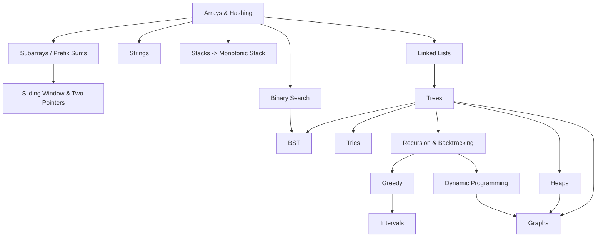

# DSA Notes — Google / FAANG Prep Index

> Master index for all topic guides in this folder.
> Each file follows the same shape: intuition → mental triggers → reusable
> templates (with Time/Space) → worked problems → pitfalls → cheat sheet →
> ranked problem ladder (Basic → Hard) → quiz → mini project.

---

## 1. All topics

| # | Topic | File | Lines | Core idea in one line |
|---|-------|------|-------|-----------------------|
| 1 | Arrays & Hashing | [arrays.md](arrays.md) | 2035 | Index tricks, prefix/difference arrays, hash for O(1) lookup |
| 2 | Subarrays | [subarrays.md](subarrays.md) | 520 | Prefix sums + hashmap; the negatives case |
| 3 | Sliding Window & Two Pointers | [sliding_window.md](sliding_window.md) | 1252 | O(n²) → O(n) when window validity is monotone |
| 4 | Strings | [strings.md](strings.md) | 1281 | Frequency, palindromes, KMP/Z/Rabin–Karp, parsing |
| 5 | Stacks | [stacks.md](stacks.md) | 210 | "Most recent unresolved thing" |
| 6 | Monotonic Stack | [monotonic_stack.md](monotonic_stack.md) | 173 | Next greater / smaller element |
| 7 | Linked Lists | [linked_list.md](linked_list.md) | 2061 | Dummy head, fast & slow, prev/cur/next |
| 8 | Binary Search | [binary_search.md](binary_search.md) | 970 | Find the boundary in a monotone predicate (FFFF…TTTT) |
| 9 | Trees | [trees.md](trees.md) | 1072 | Decide what flows down and what returns up |
| 10 | Binary Search Trees | [bst.md](bst.md) | 976 | Inorder of a BST is sorted |
| 11 | Tries | [tries.md](tries.md) | 1336 | The path spells the key → prefix queries |
| 12 | Heaps & Priority Queues | [heaps.md](heaps.md) | 1299 | Always take the current best |
| 13 | Recursion & Backtracking | [recursion.md](recursion.md) | 1410 | Inductive contract; choose / explore / un-choose |
| 14 | Greedy | [greedy.md](greedy.md) | 1551 | Local choice + an exchange-argument proof |
| 15 | Dynamic Programming | [dp.md](dp.md) | 2274 | State → transition → base → order → answer |
| 16 | Graphs | [graphs.md](graphs.md) | 2861 | Everything is a graph; pick the right traversal |
| 17 | Intervals | [intervals.md](intervals.md) | 211 | Sort first, then sweep |

---

## 2. Suggested study order

Dependencies matter — later topics reuse earlier templates.

**Phase 1 — foundations:** Arrays → Subarrays → Sliding Window → Strings → Stacks/Monotonic Stack → Linked Lists
**Phase 2 — search & hierarchies:** Binary Search → Trees → BST → Tries → Heaps
**Phase 3 — the hard half:** Recursion/Backtracking → Greedy → DP → Graphs → Intervals

Do Phase 3 last: DP and Graphs are where Google interviews are actually decided,
but they are much easier once the earlier templates are automatic.

---

## 3. How to use these notes

1. **Read the intuition sections first.** Skip the problem lists on pass one.
2. **Type each template from memory** until you can reproduce it without looking.
   Templates are the unit of recall in an interview, not individual problems.
3. **Then work the ladder** in each file: Basic → Medium → Hard. Aim to
   recognise the template within 2 minutes of reading a problem.
4. **Use the "Common pitfalls" section as a pre-submit checklist.**
5. **Take the quiz** at the end of each file a week after reading it.
6. **Build the mini project** — it forces the data structure into long-term memory.

---

## 4. Interview script (works for every topic)

1. Restate the problem and confirm constraints (`n` size, value ranges,
   duplicates, negatives, sorted?, empty input?).
2. State the brute force + its complexity out loud.
3. Name the pattern you are reaching for and the **mental trigger** that fired.
4. State the target complexity before coding.
5. Code the template, narrating invariants.
6. Dry-run on the sample, then on the edge cases (`n=0,1,2`, all-equal, all-negative).
7. State final Time/Space and one possible follow-up optimisation.

---

## 5. Cross-cutting cheat sheet

| Signal in the problem statement | Go to |
|---|---|
| "sorted array", "minimise the maximum" | [binary_search.md](binary_search.md) |
| "contiguous subarray", "sum equals k" | [subarrays.md](subarrays.md) |
| "longest/shortest substring with condition" | [sliding_window.md](sliding_window.md) |
| "next greater", "largest rectangle" | [monotonic_stack.md](monotonic_stack.md) |
| "kth largest", "top K", "median of stream" | [heaps.md](heaps.md) |
| "prefix", "autocomplete", "maximum XOR" | [tries.md](tries.md) |
| "all combinations/permutations/partitions" | [recursion.md](recursion.md) |
| "count the ways", "min cost", overlapping choices | [dp.md](dp.md) |
| "shortest path", "dependencies", "connected" | [graphs.md](graphs.md) |
| "merge/overlap/schedule ranges" | [intervals.md](intervals.md) |
| "maximise while scanning once" | [greedy.md](greedy.md) |
