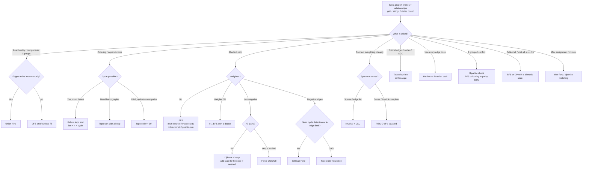

# Graphs — Complete Guide

> Google DSA prep notes. Category: Graphs (the single biggest topic at Google).
> Everything from "what is an adjacency list" to Tarjan, max-flow and bit-state BFS.
> If a problem has *entities* and *relationships*, it is a graph problem — even when
> the input is a grid, a list of strings, or a set of board states.

---

## 1. Vocabulary & representations

### 1.1 The vocabulary you must be fluent in

| Term | Meaning | Why it matters in an interview |
|---|---|---|
| **Vertex / node (V)** | An entity | `n` in complexity |
| **Edge (E)** | A relationship | `m` or `E` in complexity |
| **Directed** | `u → v` only | Cycle detection needs colours, not parent-check |
| **Undirected** | `u ↔ v`, store both ways | Parent-check cycle detection, DSU works |
| **Weighted** | Edge carries a cost | BFS is wrong → Dijkstra / Bellman-Ford |
| **Dense** | `E ≈ V²` | Matrix / `O(V²)` Prim / Floyd-Warshall are fine |
| **Sparse** | `E ≈ V` | Adjacency list + heap-based algorithms |
| **Self-loop** | Edge `u → u` | Breaks naive cycle checks; ask about it |
| **Multigraph** | Two+ edges between the same pair | Breaks `v == parent` cycle checks |
| **DAG** | Directed **A**cyclic **G**raph | Topological sort + DP over the order |
| **Connected** | (undirected) every pair reachable | Loop over all starts, don't assume one component |
| **Strongly connected** | (directed) every pair mutually reachable | Tarjan / Kosaraju SCC |
| **Bipartite** | 2-colourable; no odd cycle | BFS colouring or DSU |
| **Tree** | Connected, acyclic, `E == V - 1` | Both conditions needed (LC 261) |
| **Forest** | Disjoint union of trees | DSU component count |
| **In-degree / out-degree** | Incoming / outgoing edge count | Kahn's algorithm, "eventual safe states" |
| **Bridge** | Edge whose removal disconnects | Tarjan low-link (LC 1192) |
| **Articulation point** | Vertex whose removal disconnects | Tarjan low-link |
| **Eulerian path** | Uses every **edge** exactly once | Hierholzer (LC 332) |
| **Hamiltonian path** | Visits every **vertex** exactly once | NP-hard → bitmask DP for small `n` |

### 1.2 Representations

```python
from collections import defaultdict

# (a) Adjacency list — the default choice, 95% of problems
adj = defaultdict(list)          # or [[] for _ in range(n)] when nodes are 0..n-1
adj[u].append(v)

# (b) Adjacency matrix — dense graphs, O(1) edge lookup, Floyd-Warshall
mat = [[0] * n for _ in range(n)]
mat[u][v] = w

# (c) Edge list — Kruskal (sort edges), Bellman-Ford (relax all edges)
edges = [(w, u, v), ...]

# (d) Implicit graph — no data structure at all; neighbours are COMPUTED
def neighbours(state):
    ...                          # yield successor states on demand
```

| Representation | Space | Check edge `u→v` | Iterate neighbours of `u` | Use when |
|---|---|---|---|---|
| Adjacency list | `O(V + E)` | `O(deg(u))` | `O(deg(u))` | Default; sparse graphs |
| Adjacency matrix | `O(V²)` | `O(1)` | `O(V)` | `V ≤ ~1000`, dense, Floyd-Warshall |
| Edge list | `O(E)` | `O(E)` | `O(E)` | Kruskal, Bellman-Ford |
| Implicit | `O(states visited)` | n/a | `O(branching)` | Grids, strings, board states |

`V = 10^5` with a matrix = `10^10` cells = instant MLE. **Never build a matrix
unless `V ≤ ~2000`.**

### 1.3 The implicit-graph idea (this is the Google insight)

Most Google graph questions never hand you `edges`. They hand you something else
and expect *you* to see the graph:

| Problem shape | Node | Edge |
|---|---|---|
| Grid / maze | a cell `(r, c)` | move to an adjacent cell |
| Word ladder | a word | change one letter |
| Open the Lock | a 4-digit combination | turn one wheel one click |
| Sliding Puzzle | a board configuration (string) | slide one tile |
| Jump Game IV | an index | `i±1` or any index with the same value |
| Bus Routes | a bus stop (or a route) | share a route (or share a stop) |
| Evaluate Division | a variable name | a known ratio `a/b` |
| Course Schedule | a course | a prerequisite |
| Race Car | `(position, speed)` | `'A'` or `'R'` instruction |
| Minimum Genetic Mutation | a gene string | one-character mutation |

**Mental trigger:** *"minimum number of steps / moves / transformations"* over a
finite set of configurations → BFS on an implicit graph, with a `visited` set keyed
by the whole state.

---

## 2. Building the graph

### 2.1 Edge list → adjacency list

```python
from collections import defaultdict

def build(n, edges, directed=False, weighted=False):
    adj = [[] for _ in range(n)]
    for e in edges:
        if weighted:
            u, v, w = e
            adj[u].append((v, w))
            if not directed:
                adj[v].append((u, w))
        else:
            u, v = e
            adj[u].append(v)
            if not directed:
                adj[v].append(u)
    return adj
```
**Time / Space:** `O(V + E)` / `O(V + E)`.

Use `defaultdict(list)` when node labels are strings or sparse ints
(`"JFK"`, `"alice@x.com"`). Use a plain list-of-lists when nodes are `0..n-1` —
it is ~2× faster and avoids accidental key creation.

> **Silent bug:** reading `adj[x]` on a `defaultdict` *creates* the key. If you
> later do `len(adj)` or iterate `adj` to count nodes, the count is wrong. Use
> `adj.get(x, [])` for read-only access when the count matters.

### 2.2 Grid neighbours — the `DIRS` idiom

```python
DIRS = ((-1, 0), (1, 0), (0, -1), (0, 1))            # 4-directional
DIRS8 = tuple((dr, dc) for dr in (-1, 0, 1)
                        for dc in (-1, 0, 1) if (dr, dc) != (0, 0))

def neighbours(r, c, R, C):
    for dr, dc in DIRS:
        nr, nc = r + dr, c + dc
        if 0 <= nr < R and 0 <= nc < C:               # bounds first, always
            yield nr, nc
```

Two habits that prevent most grid bugs:
1. `R, C = len(grid), len(grid[0])` at the top — never mix up rows and cols later.
2. Bounds check **before** indexing. Python's negative indexing means `grid[-1][0]`
   silently reads the last row instead of raising.

### 2.3 0-indexed vs 1-indexed

```python
# Problem gives nodes 1..n (very common in LC 684, 685, 1192-style inputs)
adj = [[] for _ in range(n + 1)]      # allocate n+1, ignore slot 0
# or normalise once at the boundary:
edges = [(u - 1, v - 1) for u, v in edges]
```
Pick **one** convention and normalise at the input boundary. Mixing them mid-solution
is the #1 source of off-by-one WAs in graph problems.

---

## 3. DFS

**Mental trigger:** *"explore everything / does a path exist / connected components /
detect a cycle / do work on the way back up"* → DFS.

### 3.1 Recursive template

```python
def dfs(u, adj, visited):
    visited.add(u)
    # ---- pre-order work here ----
    for v in adj[u]:
        if v not in visited:
            dfs(v, adj, visited)
    # ---- post-order work here (subtree fully processed) ----
```
**Time / Space:** `O(V + E)` / `O(V)` visited + `O(V)` recursion stack.

> **Python trap:** the default recursion limit is 1000. A path graph with
> `V = 10^5` blows the stack. Fixes:
> ```python
> import sys, threading
> sys.setrecursionlimit(300000)
> threading.Thread(target=main, args=(), kwargs={}).start()   # bigger stack
> ```
> In an interview, **say this out loud and offer the iterative version** — it
> signals production awareness.

### 3.2 Iterative DFS and the "mark on push vs mark on pop" subtlety

```python
def dfs_iterative(start, adj):
    visited = {start}
    stack = [start]
    order = []
    while stack:
        u = stack.pop()
        order.append(u)
        for v in adj[u]:
            if v not in visited:
                visited.add(v)        # MARK ON PUSH
                stack.append(v)
    return order
```
**Time / Space:** `O(V + E)` / `O(V)`.

- **Mark on push** — each node enters the stack at most once. Stack size `O(V)`.
  The traversal order is *a* valid DFS order but not identical to the recursive
  one (children come off the stack in reverse). Use `reversed(adj[u])` to match.
- **Mark on pop** — a node can be pushed once per incoming edge before it is
  popped. Stack size becomes `O(E)`, and on a dense graph that is `O(V²)` memory.
  It is still correct if you also `if u in visited: continue` after popping, but
  it is strictly worse. **Mark on push unless you need true post-order.**

For genuine post-order (needed by Tarjan, Kosaraju, DFS topo sort) keep an
explicit iterator per frame:

```python
def dfs_postorder(start, adj):
    visited = {start}
    stack = [(start, iter(adj[start]))]
    post = []
    while stack:
        u, it = stack[-1]
        for v in it:                      # resumes the SAME iterator object
            if v not in visited:
                visited.add(v)
                stack.append((v, iter(adj[v])))
                break
        else:                             # iterator exhausted → node finished
            post.append(u)
            stack.pop()
    return post
```
**Time / Space:** `O(V + E)` / `O(V)`.

### 3.3 Connected components

```python
def count_components(n, edges):
    adj = [[] for _ in range(n)]
    for u, v in edges:
        adj[u].append(v)
        adj[v].append(u)
    visited = [False] * n
    comps = 0
    for s in range(n):
        if visited[s]:
            continue
        comps += 1                        # every unvisited start = new component
        stack = [s]
        visited[s] = True
        while stack:
            u = stack.pop()
            for v in adj[u]:
                if not visited[v]:
                    visited[v] = True
                    stack.append(v)
    return comps
```
**Time / Space:** `O(V + E)` / `O(V + E)`.

**Never** assume the graph is connected. The outer `for s in range(n)` loop is the
difference between AC and WA on half of these problems.

### 3.4 Three-colour DFS — cycle detection in a **directed** graph

White = unvisited, **Gray = on the current recursion stack**, Black = fully done.
A back-edge to a **gray** node is a cycle. An edge to a **black** node is fine
(that subtree is already known to be safe).

```python
WHITE, GRAY, BLACK = 0, 1, 2

def has_cycle_directed(n, adj):
    color = [WHITE] * n

    def dfs(u):
        color[u] = GRAY
        for v in adj[u]:
            if color[v] == GRAY:          # back-edge → cycle
                return True
            if color[v] == WHITE and dfs(v):
                return True
        color[u] = BLACK                  # finished: u leads to no cycle
        return False

    return any(color[s] == WHITE and dfs(s) for s in range(n))
```
**Time / Space:** `O(V + E)` / `O(V)`.

The single most common bug here is using one boolean `visited` array: that reports
a "cycle" for a diamond `a→b, a→c, b→d, c→d`, which is a perfectly valid DAG.
**Two states are not enough for directed graphs.**

Same machinery solves **LC 802 Find Eventual Safe States** — a node is safe iff it
finishes BLACK without ever touching a GRAY node.

### 3.5 Cycle detection in an **undirected** graph (DFS with parent)

```python
def has_cycle_undirected(n, adj):
    visited = [False] * n

    def dfs(u, parent):
        visited[u] = True
        for v in adj[u]:
            if not visited[v]:
                if dfs(v, u):
                    return True
            elif v != parent:             # visited and not where we came from
                return True
        return False

    return any(not visited[s] and dfs(s, -1) for s in range(n))
```
**Time / Space:** `O(V + E)` / `O(V)`.

> **Multi-edge trap:** if the input contains `[0,1]` twice, `v != parent` fails to
> detect that legitimate 2-cycle. Fix by tracking the **edge id** you arrived on
> instead of the parent node (see §11.1), or by de-duplicating edges up front.

### 3.6 DFS on a grid (flood fill) + in-place marking

```python
def num_islands(grid):
    if not grid:
        return 0
    R, C = len(grid), len(grid[0])
    count = 0
    for r in range(R):
        for c in range(C):
            if grid[r][c] != '1':
                continue
            count += 1
            stack = [(r, c)]
            grid[r][c] = '0'              # sink on PUSH, not on pop
            while stack:
                x, y = stack.pop()
                for dx, dy in DIRS:
                    nx, ny = x + dx, y + dy
                    if 0 <= nx < R and 0 <= ny < C and grid[nx][ny] == '1':
                        grid[nx][ny] = '0'
                        stack.append((nx, ny))
    return count
```
**Time / Space:** `O(R·C)` / `O(R·C)` worst-case stack, `O(1)` extra for `visited`.

In-place marking replaces the `visited` set entirely. **Always ask "may I mutate
the input?"** — if yes, you save `O(R·C)` memory; if no, use a `visited` set (or a
sentinel you restore afterwards, as in Word Search).

---

## 4. BFS

**Mental trigger:** *"shortest path / minimum steps in an **unweighted** graph"* →
BFS. BFS visits nodes in non-decreasing distance order, so the first time you pop a
node you already have its optimal distance.

### 4.1 Plain BFS template

```python
from collections import deque

def bfs(start, target, adj):
    q = deque([start])
    dist = {start: 0}                     # visited + distance in one structure
    while q:
        u = q.popleft()
        if u == target:
            return dist[u]
        for v in adj[u]:
            if v not in dist:
                dist[v] = dist[u] + 1
                q.append(v)               # mark visited AT ENQUEUE TIME
    return -1
```
**Time / Space:** `O(V + E)` / `O(V)`.

> Marking visited when you **dequeue** instead of when you **enqueue** lets the
> same node be queued once per in-edge. Correctness survives, the queue does not:
> memory goes from `O(V)` to `O(E)` and on dense/branching state spaces the program
> dies. This is the single most common BFS performance bug.

### 4.2 Level-by-level BFS

When you need the level number, the size of each level, or to process a whole
"wave" together (word ladder path lengths, tree level order, rotting minutes):

```python
def bfs_levels(start, adj):
    q = deque([start])
    seen = {start}
    level = 0
    while q:
        for _ in range(len(q)):           # snapshot the level size FIRST
            u = q.popleft()
            for v in adj[u]:
                if v not in seen:
                    seen.add(v)
                    q.append(v)
        level += 1
    return level
```
`for _ in range(len(q))` must capture the length *before* the loop body appends.
Writing `while q:` inside would consume the next level too.

### 4.3 Multi-source BFS

Seed the queue with **all** sources at distance 0, then run one ordinary BFS.

```python
def oranges_rotting(grid):                              # LC 994
    R, C = len(grid), len(grid[0])
    q = deque()
    fresh = 0
    for r in range(R):
        for c in range(C):
            if grid[r][c] == 2:
                q.append((r, c))                        # ALL rotten cells at t=0
            elif grid[r][c] == 1:
                fresh += 1
    minutes = 0
    while q and fresh:
        for _ in range(len(q)):
            r, c = q.popleft()
            for dr, dc in DIRS:
                nr, nc = r + dr, c + dc
                if 0 <= nr < R and 0 <= nc < C and grid[nr][nc] == 1:
                    grid[nr][nc] = 2
                    fresh -= 1
                    q.append((nr, nc))
        minutes += 1
    return -1 if fresh else minutes
```
**Time / Space:** `O(R·C)` / `O(R·C)`.

**Why multi-source is correct:** conceptually you add a virtual super-source `S`
with a 0-weight edge to every real source. BFS from `S` then computes
`min over sources of dist(source, x)` for every `x` — exactly what
"distance to the *nearest* gate / nearest 0 / nearest rotten orange" means. You
get all `n` shortest-path computations for the price of one traversal:
`O(V + E)` instead of `O(sources · (V + E))`.

```python
def update_matrix(mat):                                 # LC 542  (01 Matrix)
    R, C = len(mat), len(mat[0])
    dist = [[-1] * C for _ in range(R)]
    q = deque()
    for r in range(R):
        for c in range(C):
            if mat[r][c] == 0:
                dist[r][c] = 0
                q.append((r, c))                        # every 0 is a source
    while q:
        r, c = q.popleft()
        for dr, dc in DIRS:
            nr, nc = r + dr, c + dc
            if 0 <= nr < R and 0 <= nc < C and dist[nr][nc] == -1:
                dist[nr][nc] = dist[r][c] + 1
                q.append((nr, nc))
    return dist
```
**Time / Space:** `O(R·C)` / `O(R·C)`.

Same skeleton solves **Walls and Gates (LC 286)** (sources = gates) and
**Shortest Bridge (LC 934)** (flood-fill island A, then multi-source BFS outward
from *all* of its cells at once).

### 4.4 Bidirectional BFS

Search from both ends and stop when the frontiers touch. If the branching factor is
`b` and the answer is `d`, unidirectional BFS explores `O(b^d)` but bidirectional
explores `O(2·b^(d/2))` — a square-root-scale win.

```python
import string

def ladder_length(begin, end, word_list):               # LC 127
    words = set(word_list)
    if end not in words:
        return 0
    front, back = {begin}, {end}
    steps = 1
    while front and back:
        if len(front) > len(back):        # always expand the SMALLER frontier
            front, back = back, front
        words -= front                    # words in the current frontier are used
        nxt = set()
        for w in front:
            for i in range(len(w)):
                for ch in string.ascii_lowercase:
                    cand = w[:i] + ch + w[i + 1:]
                    if cand in back:      # frontiers met
                        return steps + 1
                    if cand in words:
                        nxt.add(cand)
        front = nxt
        steps += 1
    return 0
```
**Time / Space:** `O(N · L² · 26)` worst case / `O(N · L)`, where `N` = words,
`L` = word length — but in practice far fewer nodes are touched.

**When it pays off:** (1) you know the goal state explicitly, (2) edges are
reversible (undirected or you can build the reverse graph), (3) uniform edge
weight, (4) the branching factor is high. Word Ladder, Open the Lock, and
Sliding Puzzle all qualify. It does **not** apply when the target is a
*property* ("any cell on the border") rather than a specific node.

The `if len(front) > len(back): swap` line is what makes it fast — it keeps the
work balanced instead of letting one side blow up.

---

## 5. 0-1 BFS (deque BFS)

When every edge weight is **0 or 1**, you do not need a heap.

```python
from collections import deque

def zero_one_bfs(n, adj, src):            # adj[u] = [(v, w) with w in {0,1}]
    INF = float('inf')
    dist = [INF] * n
    dist[src] = 0
    dq = deque([src])
    while dq:
        u = dq.popleft()
        for v, w in adj[u]:
            if dist[u] + w < dist[v]:
                dist[v] = dist[u] + w
                if w == 0:
                    dq.appendleft(v)      # same layer → front
                else:
                    dq.append(v)          # next layer → back
    return dist
```
**Time / Space:** `O(V + E)` / `O(V)`.

**Intuition:** Dijkstra's priority queue exists only to always pop the smallest
tentative distance. With weights in `{0,1}`, the queue only ever holds two distinct
distance values, `d` and `d+1`. A deque maintains that ordering for free: 0-weight
moves stay in the current layer (push front), 1-weight moves start the next layer
(push back). The deque is therefore always sorted, which is exactly Dijkstra's
invariant — without the `log V` factor.

**Why it beats Dijkstra:** `O(V + E)` vs `O(E log V)`. On a `10^5 × 10^5`-edge grid
that is a 17× constant-factor difference, and it removes all heap-tuple overhead.

```python
def minimum_obstacles(grid):                            # LC 2290
    R, C = len(grid), len(grid[0])
    INF = float('inf')
    dist = [[INF] * C for _ in range(R)]
    dist[0][0] = grid[0][0]
    dq = deque([(0, 0)])
    while dq:
        r, c = dq.popleft()
        if (r, c) == (R - 1, C - 1):
            return dist[r][c]
        for dr, dc in DIRS:
            nr, nc = r + dr, c + dc
            if 0 <= nr < R and 0 <= nc < C:
                nd = dist[r][c] + grid[nr][nc]          # cost 0 (empty) or 1 (wall)
                if nd < dist[nr][nc]:
                    dist[nr][nc] = nd
                    (dq.appendleft if grid[nr][nc] == 0 else dq.append)((nr, nc))
    return dist[R - 1][C - 1]
```
**Time / Space:** `O(R·C)` / `O(R·C)`.

Same technique: **LC 1368 Min Cost to Make at Least One Valid Path in a Grid**
(following the arrow costs 0, turning costs 1) and **LC 1091**-style problems where
some moves are free.

**Mental trigger:** *"two kinds of moves, one free and one costing 1"* → 0-1 BFS.

---

## 6. Topological sort

Only defined on a **DAG**. Produces an ordering where every edge points forward.

**Mental trigger:** *"prerequisites / build order / dependencies / can this be
scheduled"* → topological sort. If the sort fails to cover all nodes, there is a
cycle.

### 6.1 Kahn's algorithm (BFS, in-degree)

```python
from collections import deque

def topo_kahn(n, adj):
    indeg = [0] * n
    for u in range(n):
        for v in adj[u]:
            indeg[v] += 1
    q = deque(u for u in range(n) if indeg[u] == 0)
    order = []
    while q:
        u = q.popleft()
        order.append(u)
        for v in adj[u]:
            indeg[v] -= 1                 # "u is done, one prereq satisfied"
            if indeg[v] == 0:
                q.append(v)
    return order if len(order) == n else []   # short order ⇒ cycle
```
**Time / Space:** `O(V + E)` / `O(V)`.

Kahn's gives **cycle detection for free**: nodes stuck inside a cycle never reach
in-degree 0, so `len(order) < n`. This is exactly **LC 207 Course Schedule** (return
the boolean) and **LC 210 Course Schedule II** (return the order).

If you also count levels (`for _ in range(len(q))` per round), you get the
**minimum number of semesters** — **LC 1136 / 2050 Parallel Courses**.

### 6.2 DFS post-order version

```python
def topo_dfs(n, adj):
    WHITE, GRAY, BLACK = 0, 1, 2
    color = [WHITE] * n
    order = []

    def dfs(u):
        color[u] = GRAY
        for v in adj[u]:
            if color[v] == GRAY:
                return False              # cycle
            if color[v] == WHITE and not dfs(v):
                return False
        color[u] = BLACK
        order.append(u)                   # append on the way OUT
        return True

    for s in range(n):
        if color[s] == WHITE and not dfs(s):
            return []
    return order[::-1]                    # reverse post-order = topo order
```
**Time / Space:** `O(V + E)` / `O(V)`.

**Why reverse post-order works:** a node is appended only after every node it can
reach has been appended. So in the raw post-order list, every node appears *after*
all of its descendants; reversing puts it *before* them, which is the definition of
a topological order.

Use Kahn's when you want lexicographic control, level counts, or an iterative
solution. Use DFS when you already need post-order for something else (SCC, DAG DP).

### 6.3 Lexicographically smallest topological order

Swap the queue for a min-heap.

```python
import heapq

def topo_smallest(n, adj):
    indeg = [0] * n
    for u in range(n):
        for v in adj[u]:
            indeg[v] += 1
    heap = [u for u in range(n) if indeg[u] == 0]
    heapq.heapify(heap)
    order = []
    while heap:
        u = heapq.heappop(heap)           # smallest available node, greedily
        order.append(u)
        for v in adj[u]:
            indeg[v] -= 1
            if indeg[v] == 0:
                heapq.heappush(heap, v)
    return order if len(order) == n else []
```
**Time / Space:** `O(V log V + E)` / `O(V)`.

Greedy is optimal here: taking the smallest currently-available node can never
prevent a valid completion, because the remaining sub-DAG is still a DAG.

### 6.4 Uniqueness and counting

- **Unique topological order** iff at every step the frontier has exactly one node
  (`len(q) == 1` throughout Kahn's). Equivalently, the order forms a Hamiltonian
  path in the DAG: consecutive nodes must be directly connected. This is
  **LC 444 Sequence Reconstruction**.

```python
def is_unique_topo(n, adj):
    indeg = [0] * n
    for u in range(n):
        for v in adj[u]:
            indeg[v] += 1
    q = deque(u for u in range(n) if indeg[u] == 0)
    seen = 0
    while q:
        if len(q) > 1:                    # a choice exists ⇒ not unique
            return False
        u = q.popleft()
        seen += 1
        for v in adj[u]:
            indeg[v] -= 1
            if indeg[v] == 0:
                q.append(v)
    return seen == n
```
**Time / Space:** `O(V + E)` / `O(V)`.

- **Counting** all topological orders is `#P`-complete in general; for `n ≤ ~20`
  use bitmask DP over placed nodes:

```python
def count_topo_orders(n, adj):
    prereq = [0] * n                      # prereq[v] = bitmask of nodes before v
    for u in range(n):
        for v in adj[u]:
            prereq[v] |= 1 << u
    dp = [0] * (1 << n)
    dp[0] = 1
    for mask in range(1 << n):
        if not dp[mask]:
            continue
        for v in range(n):
            if mask >> v & 1:
                continue
            if prereq[v] & ~mask:         # some prerequisite not placed yet
                continue
            dp[mask | (1 << v)] += dp[mask]
    return dp[(1 << n) - 1]
```
**Time / Space:** `O(2^n · n)` / `O(2^n)`.

### 6.5 Longest path in a DAG + DP over a DAG

The longest path is NP-hard in general graphs but **linear** on a DAG, because the
topological order gives a valid DP evaluation order.

```python
def longest_path_dag(n, edges):           # edges = [(u, v, w)]
    adj = [[] for _ in range(n)]
    indeg = [0] * n
    for u, v, w in edges:
        adj[u].append((v, w))
        indeg[v] += 1
    q = deque(u for u in range(n) if indeg[u] == 0)
    dist = [0] * n                        # dist[v] = longest path ending at v
    seen = 0
    while q:
        u = q.popleft()
        seen += 1
        for v, w in adj[u]:
            if dist[u] + w > dist[v]:     # relax in topo order = each edge once
                dist[v] = dist[u] + w
            indeg[v] -= 1
            if indeg[v] == 0:
                q.append(v)
    if seen != n:
        raise ValueError("graph has a cycle")
    return max(dist)
```
**Time / Space:** `O(V + E)` / `O(V + E)`.

Flip `>` to `<` (and init to `+inf` except the source) for **shortest path in a
DAG**, which also handles **negative weights** correctly and beats Dijkstra.

The same "DP over a DAG" idea powers **LC 329 Longest Increasing Path in a Matrix**
(the implicit graph "cell → strictly larger neighbour" is acyclic, so plain memoised
DFS is a DAG DP) and **LC 1976 Number of Ways to Arrive at Destination** (run
Dijkstra, then count paths over the shortest-path DAG).

---

## 7. Union-Find (Disjoint Set Union)

**Mental trigger:** *"are these two in the same group / merge groups / count groups
/ detect a cycle while adding edges / process edges in sorted order"* → DSU.
DSU is for **incremental merging**. It cannot split.

### 7.1 Production implementation

```python
class DSU:
    __slots__ = ("parent", "size", "count")

    def __init__(self, n):
        self.parent = list(range(n))
        self.size = [1] * n
        self.count = n                    # number of disjoint components

    def find(self, x):
        root = x
        while self.parent[root] != root:
            root = self.parent[root]
        while self.parent[x] != root:     # path compression, iterative
            self.parent[x], x = root, self.parent[x]
        return root

    def union(self, a, b):
        ra, rb = self.find(a), self.find(b)
        if ra == rb:
            return False                  # already together ⇒ this edge is a cycle
        if self.size[ra] < self.size[rb]: # union by size: small tree under big
            ra, rb = rb, ra
        self.parent[rb] = ra
        self.size[ra] += self.size[rb]
        self.count -= 1
        return True

    def connected(self, a, b):
        return self.find(a) == self.find(b)

    def comp_size(self, x):
        return self.size[self.find(x)]
```
**Time / Space:** `O(α(n))` amortised per op / `O(n)`.

**What `α(n)` means:** `α` is the inverse Ackermann function. Union by size alone
gives `O(log n)` (tree height can only double when the size doubles). Path
compression alone gives `O(log n)` amortised. **Together** they give
`O(α(n))` amortised, and `α(n) ≤ 4` for any `n` below the number of atoms in the
universe. So it is "effectively constant" — but say *amortised near-constant*, not
"O(1)", if you want to be precise.

Union by **rank** (tree height) is equivalent asymptotically; union by **size** is
more useful because you often need component sizes anyway
(LC 827 Making a Large Island, LC 128 Longest Consecutive Sequence).

### 7.2 The iterative `find` matters

The recursive one-liner `if p[x] != x: p[x] = find(p[x])` is elegant and will
`RecursionError` on a `10^5`-node path graph built by adversarial input. The
two-pass iterative version above is the same complexity with no stack risk.

### 7.3 Weighted / relational DSU

Store, for each node, the ratio (or offset) relative to its parent. Compose along
the path during compression.

```python
class WeightedDSU:
    """w[x] = value(x) / value(parent[x])."""

    def __init__(self):
        self.parent = {}
        self.w = {}

    def add(self, x):
        if x not in self.parent:
            self.parent[x] = x
            self.w[x] = 1.0

    def find(self, x):
        if self.parent[x] != x:
            root = self.find(self.parent[x])       # compress parent first
            self.w[x] *= self.w[self.parent[x]]    # then compose the ratio
            self.parent[x] = root
        return self.parent[x]

    def union(self, x, y, val):                    # value(x) / value(y) = val
        self.add(x)
        self.add(y)
        rx, ry = self.find(x), self.find(y)
        if rx == ry:
            return
        self.parent[rx] = ry
        # x/rx = w[x], y/ry = w[y]  ⇒  rx/ry = val * w[y] / w[x]
        self.w[rx] = val * self.w[y] / self.w[x]

    def ratio(self, x, y):
        if x not in self.parent or y not in self.parent:
            return -1.0
        if self.find(x) != self.find(y):
            return -1.0
        return self.w[x] / self.w[y]               # (x/root) / (y/root)
```
**Time / Space:** `O(α(n))` per op / `O(n)`.

This is **LC 399 Evaluate Division** in ~20 lines with `O(1)` queries after
building, versus BFS-per-query at `O(Q · (V + E))`.

The additive variant (`w[x] = value(x) - value(parent[x])`) handles difference
constraints. The `mod 2` variant (`w[x] = parity of x relative to parent`) gives a
**bipartite / "enemy" DSU**: `union(x, y, 1)` means "different sides", and a
contradiction means the graph is not bipartite (LC 886 Possible Bipartition).

For **LC 990 Satisfiability of Equality Equations**: process all `==` first with a
plain DSU, then verify no `!=` pair is in the same component. Order matters —
processing `!=` early would be checking a constraint against an incomplete graph.

### 7.4 DSU with rollback (offline queries)

Path compression makes undo impossible (it rewrites arbitrary parents). Drop
compression, keep only union by size (`O(log n)` per op), and push the single
modified slot onto a history stack:

```python
class RollbackDSU:
    def __init__(self, n):
        self.parent = list(range(n))
        self.size = [1] * n
        self.history = []                 # (child_root, parent_root)

    def find(self, x):                    # NO path compression
        while self.parent[x] != x:
            x = self.parent[x]
        return x

    def union(self, a, b):
        ra, rb = self.find(a), self.find(b)
        if ra == rb:
            self.history.append(None)     # record a no-op so rollback stays aligned
            return False
        if self.size[ra] < self.size[rb]:
            ra, rb = rb, ra
        self.parent[rb] = ra
        self.size[ra] += self.size[rb]
        self.history.append((rb, ra))
        return True

    def rollback(self):
        rec = self.history.pop()
        if rec is None:
            return
        child, root = rec
        self.parent[child] = child
        self.size[root] -= self.size[child]
```
**Time / Space:** `O(log n)` per op / `O(n + ops)`.

Used with **DSU on tree / offline dynamic connectivity** (segment tree on time).
Rarely required — but knowing *why* compression forbids rollback is a strong signal.

A simpler and far more common offline trick: **sort queries by threshold, sort
edges by weight, and sweep** — adding edges to a normal DSU as the threshold grows.
That is **LC 1697 Checking Existence of Edge Length Limited Paths** and
**LC 1101 The Earliest Moment When Everyone Become Friends**.

### 7.5 DSU application gallery

| Problem | Trick |
|---|---|
| LC 547 Number of Provinces | `dsu.count` after unioning the matrix |
| LC 261 Graph Valid Tree | `n - 1` edges **and** every `union` returns `True` |
| LC 684 Redundant Connection | first edge where `union` returns `False` |
| LC 685 Redundant Connection II | directed: handle the "node with 2 parents" case first |
| LC 721 Accounts Merge | union emails within an account; group by root |
| LC 305 Number of Islands II | add land incrementally, `count += 1` then union neighbours |
| LC 1584 Min Cost to Connect All Points | Kruskal on all `C(n,2)` edges |
| LC 128 Longest Consecutive Sequence | union `x` with `x+1`; answer = max component size |
| LC 778 Swim in Rising Water | add cells in height order, stop when `(0,0)` and `(n-1,n-1)` connect |
| LC 827 Making a Large Island | size per island + try flipping each `0` |
| LC 959 Regions Cut By Slashes | split each cell into 4 triangles, union per glyph |

---

## 8. Shortest paths

### 8.1 Decision table

| Situation | Algorithm | Complexity |
|---|---|---|
| Unweighted (all edges cost 1) | BFS | `O(V + E)` |
| Weights ∈ {0, 1} | 0-1 BFS (deque) | `O(V + E)` |
| Small integer weights `≤ k` | Dial's algorithm (bucket queue) | `O(V·k + E)` |
| Non-negative weights, one source | **Dijkstra** | `O(E log V)` |
| DAG (any weights, incl. negative) | Topo order + relax | `O(V + E)` |
| Negative edges, one source | **Bellman-Ford** | `O(V·E)` |
| Need to detect a negative cycle | Bellman-Ford (extra `V`-th pass) | `O(V·E)` |
| At most `k` edges | Bellman-Ford, `k` rounds | `O(k·E)` |
| All pairs, `V ≤ ~500` | **Floyd-Warshall** | `O(V³)` |
| All pairs, sparse, non-negative | Dijkstra × V | `O(V·E log V)` |
| Huge/implicit space + good heuristic | **A\*** | depends on `h` |

### 8.2 Dijkstra with a heap and lazy deletion

```python
import heapq

def dijkstra(n, adj, src):                # adj[u] = [(v, w)] with w >= 0
    INF = float('inf')
    dist = [INF] * n
    dist[src] = 0
    pq = [(0, src)]
    while pq:
        d, u = heapq.heappop(pq)
        if d > dist[u]:                   # LAZY DELETION: stale entry, skip
            continue
        for v, w in adj[u]:
            nd = d + w
            if nd < dist[v]:              # strictly better ⇒ relax and push
                dist[v] = nd
                heapq.heappush(pq, (nd, v))
    return dist
```
**Time / Space:** `O(E log V)` (heap holds ≤ `E` entries) / `O(V + E)`.

**Lazy deletion explained.** `heapq` has no `decrease-key`, so instead of updating
an existing entry we push a *new, better* one and leave the old one to rot. The
guard `if d > dist[u]: continue` discards those stale entries when they surface.
Without that guard the algorithm is still *correct* (you re-relax with worse values,
which changes nothing) but you re-scan every node's adjacency list once per push,
which degrades badly — and on grids it is the difference between AC and TLE.

An equivalent guard is a `visited` set with `if u in visited: continue;
visited.add(u)`. Both are fine; **just have one of them**.

**Why Dijkstra fails on negative edges:** the algorithm's core claim is "the
smallest tentative distance in the queue is final." With a negative edge you can
later reach an already-finalised node more cheaply, so the claim collapses. Example:
`A→B = 2`, `A→C = 5`, `C→B = -4`. Dijkstra finalises `B = 2` before ever looking at
`C`, missing the true answer `1`.

### 8.3 Path reconstruction

```python
def dijkstra_path(n, adj, src, dst):
    INF = float('inf')
    dist = [INF] * n
    prev = [-1] * n
    dist[src] = 0
    pq = [(0, src)]
    while pq:
        d, u = heapq.heappop(pq)
        if d > dist[u]:
            continue
        if u == dst:
            break                          # early exit: dst is final
        for v, w in adj[u]:
            if d + w < dist[v]:
                dist[v] = d + w
                prev[v] = u                # remember who relaxed v
                heapq.heappush(pq, (d + w, v))
    if dist[dst] == INF:
        return INF, []
    path, cur = [], dst
    while cur != -1:
        path.append(cur)
        cur = prev[cur]
    return dist[dst], path[::-1]
```
**Time / Space:** `O(E log V)` / `O(V + E)`.

### 8.4 Dijkstra on a grid — LC 1631 Path With Minimum Effort

The relaxation function does not have to be a **sum**. Dijkstra works for any
*monotone* combining function (one where extending a path never improves it). Here
the cost of a path is the **maximum** single step on it — a minimax path.

```python
def minimum_effort_path(heights):
    R, C = len(heights), len(heights[0])
    INF = float('inf')
    effort = [[INF] * C for _ in range(R)]
    effort[0][0] = 0
    pq = [(0, 0, 0)]
    while pq:
        e, r, c = heapq.heappop(pq)
        if (r, c) == (R - 1, C - 1):
            return e
        if e > effort[r][c]:
            continue
        for dr, dc in DIRS:
            nr, nc = r + dr, c + dc
            if 0 <= nr < R and 0 <= nc < C:
                # combine with MAX, not +   → minimax path
                ne = max(e, abs(heights[nr][nc] - heights[r][c]))
                if ne < effort[nr][nc]:
                    effort[nr][nc] = ne
                    heapq.heappush(pq, (ne, nr, nc))
    return 0
```
**Time / Space:** `O(R·C · log(R·C))` / `O(R·C)`.

**LC 778 Swim in Rising Water** is the same shape: `ne = max(e, grid[nr][nc])`.
Both also have a DSU solution (sort cells by height, union until the corners connect)
and a binary-search-plus-BFS solution — mentioning all three is a strong answer.

### 8.5 Dijkstra with state — LC 787 Cheapest Flights Within K Stops

When the optimal answer depends on more than "which node am I at", **put the extra
information into the node**. The state becomes `(city, stops_used)`.

```python
def cheapest_flights_dijkstra(n, flights, src, dst, k):
    adj = [[] for _ in range(n)]
    for u, v, w in flights:
        adj[u].append((v, w))
    best = [[float('inf')] * (k + 2) for _ in range(n)]   # best[city][stops]
    best[src][0] = 0
    pq = [(0, src, 0)]
    while pq:
        cost, u, stops = heapq.heappop(pq)
        if u == dst:
            return cost                   # first pop of dst = cheapest overall
        if stops > k or cost > best[u][stops]:
            continue
        for v, w in adj[u]:
            if cost + w < best[v][stops + 1]:
                best[v][stops + 1] = cost + w
                heapq.heappush(pq, (cost + w, v, stops + 1))
    return -1
```
**Time / Space:** `O(E·k · log(V·k))` / `O(V·k)`.

The critical detail: the `visited` / `best` bookkeeping must be keyed by the **whole
state** `(node, stops)`, not just `node`. A more expensive route with fewer stops can
still be the one that ultimately wins.

### 8.6 Dijkstra maximising a product — LC 1514 Path with Maximum Probability

```python
def max_probability(n, edges, succ_prob, start, end):
    adj = [[] for _ in range(n)]
    for (u, v), p in zip(edges, succ_prob):
        adj[u].append((v, p))
        adj[v].append((u, p))
    best = [0.0] * n
    best[start] = 1.0
    pq = [(-1.0, start)]                  # negate: heapq is a MIN-heap
    while pq:
        neg_p, u = heapq.heappop(pq)
        p = -neg_p
        if u == end:
            return p
        if p < best[u]:
            continue
        for v, w in adj[u]:
            if p * w > best[v]:           # probabilities multiply
                best[v] = p * w
                heapq.heappush(pq, (-best[v], v))
    return 0.0
```
**Time / Space:** `O(E log V)` / `O(V + E)`.

Valid because probabilities are in `[0, 1]`, so multiplying never *increases* the
path value — the same monotonicity Dijkstra needs. Equivalently, take `-log p` and
run ordinary Dijkstra on non-negative additive weights.

### 8.7 Bellman-Ford + negative cycles

```python
def bellman_ford(n, edges, src):          # edges = [(u, v, w)], w may be negative
    INF = float('inf')
    dist = [INF] * n
    dist[src] = 0
    for _ in range(n - 1):                # a shortest path uses ≤ n-1 edges
        changed = False
        for u, v, w in edges:
            if dist[u] != INF and dist[u] + w < dist[v]:
                dist[v] = dist[u] + w
                changed = True
        if not changed:                   # early exit when settled
            break
    for u, v, w in edges:                 # n-th pass: still improving ⇒ neg cycle
        if dist[u] != INF and dist[u] + w < dist[v]:
            raise ValueError("negative cycle reachable from src")
    return dist
```
**Time / Space:** `O(V·E)` / `O(V)`.

**Why `n - 1` rounds:** any simple shortest path has at most `n - 1` edges, and
after round `i` every node whose shortest path uses `≤ i` edges is final. A further
improvement in round `n` proves some path uses `≥ n` edges, i.e. it repeats a node
around a negative-weight cycle.

To find *which* nodes are affected by a negative cycle, run `n` more rounds marking
everything that keeps improving — those are the `-inf` nodes.

**k-edge-limited variant.** Cheapest Flights Within K Stops is *natively*
Bellman-Ford: "at most `k` stops" = "at most `k + 1` edges" = "run `k + 1` rounds".
The only subtlety is snapshotting:

```python
def find_cheapest_price(n, flights, src, dst, k):
    INF = float('inf')
    dist = [INF] * n
    dist[src] = 0
    for _ in range(k + 1):                # k stops ⇒ k+1 edges
        prev = dist[:]                    # SNAPSHOT: read the previous round only
        for u, v, w in flights:
            if prev[u] + w < dist[v]:
                dist[v] = prev[u] + w
        # without the snapshot, one round could chain 2+ edges → too many stops
    return -1 if dist[dst] == INF else dist[dst]
```
**Time / Space:** `O(k·E)` / `O(V)`.

`prev[u] + w` with `prev[u] = inf` yields `inf`, which never wins — no special case
needed in Python.

### 8.8 SPFA (Shortest Path Faster Algorithm)

Bellman-Ford with a queue: only re-relax nodes whose distance actually changed.

```python
def spfa(n, adj, src):
    INF = float('inf')
    dist = [INF] * n
    dist[src] = 0
    inq = [False] * n
    relax_count = [0] * n
    q = deque([src])
    inq[src] = True
    while q:
        u = q.popleft()
        inq[u] = False
        for v, w in adj[u]:
            if dist[u] + w < dist[v]:
                dist[v] = dist[u] + w
                if not inq[v]:
                    q.append(v)
                    inq[v] = True
                    relax_count[v] += 1
                    if relax_count[v] >= n:
                        raise ValueError("negative cycle")
    return dist
```
**Time / Space:** `O(V·E)` worst case, often ~`O(E)` in practice / `O(V)`.

Fast on random graphs, but adversarial inputs push it to the full `O(V·E)`. Mention
it as "Bellman-Ford with a work queue"; do not present it as an asymptotic win.

### 8.9 Floyd-Warshall (all pairs)

```python
def floyd_warshall(n, edges, directed=True):
    INF = float('inf')
    d = [[INF] * n for _ in range(n)]
    for i in range(n):
        d[i][i] = 0
    for u, v, w in edges:
        d[u][v] = min(d[u][v], w)         # min() handles multi-edges
        if not directed:
            d[v][u] = min(d[v][u], w)
    for k in range(n):                    # k = intermediate node — MUST be outermost
        dk = d[k]
        for i in range(n):
            dik = d[i][k]
            if dik == INF:
                continue
            di = d[i]
            for j in range(n):
                if dik + dk[j] < di[j]:
                    di[j] = dik + dk[j]
    return d
```
**Time / Space:** `O(V³)` / `O(V²)`.

The loop order is the algorithm. `d[i][j]` after iteration `k` means "shortest `i→j`
path using only `{0..k}` as intermediates". Putting `k` inside breaks that invariant
and silently gives wrong answers. Negative edges are fine; a negative cycle shows up
as `d[i][i] < 0`.

**Transitive closure** (reachability): replace `min/+` with `or/and`, or use Python
ints as bitsets for a ~64× speedup:

```python
def transitive_closure_bitset(n, adj):
    reach = [0] * n
    for u in range(n):
        reach[u] = 1 << u
        for v in adj[u]:
            reach[u] |= 1 << v
    for k in range(n):
        bit = 1 << k
        for i in range(n):
            if reach[i] & bit:
                reach[i] |= reach[k]      # one word-parallel OR per (i, k)
    return reach
```
**Time / Space:** `O(V³ / 64)` / `O(V²/64)` words.

**LC 1334 Find the City With the Smallest Number of Reachable Neighbours**:
Floyd-Warshall, then for each city count `d[i][j] <= threshold`, take the largest
index among the minima. `n ≤ 100` is a giant hint that `O(V³)` is intended.

### 8.10 A\*

Dijkstra ordered by `g(n)`; A\* orders by `f(n) = g(n) + h(n)`, where `h` estimates
the remaining distance to the goal.

```python
def a_star(start, goal, neighbours, h):
    """neighbours(u) -> iterable of (v, w); h(u) -> admissible estimate to goal."""
    g = {start: 0}
    pq = [(h(start), 0, start)]
    while pq:
        _, gu, u = heapq.heappop(pq)
        if u == goal:
            return gu
        if gu > g.get(u, float('inf')):
            continue
        for v, w in neighbours(u):
            ng = gu + w
            if ng < g.get(v, float('inf')):
                g[v] = ng
                heapq.heappush(pq, (ng + h(v), ng, v))
    return -1
```
**Time / Space:** between `O(E log V)` and Dijkstra's cost, depending on `h`.

- **Admissible** `h` (never overestimates) ⇒ the answer is optimal.
- **Consistent** `h` (`h(u) ≤ w(u,v) + h(v)`) ⇒ each node is finalised once, exactly
  like Dijkstra.
- `h ≡ 0` degenerates to Dijkstra. A bad (inadmissible) `h` makes it fast but wrong.

Typical heuristics: Manhattan distance on a 4-directional grid, Chebyshev on an
8-directional grid, number of misplaced tiles for sliding puzzles.

Google touches A\* in map/routing-flavoured questions (LC 1091 Shortest Path in
Binary Matrix with a Chebyshev heuristic, LC 675 Cut Off Trees for Golf Event where
you run many point-to-point searches). Lead with BFS/Dijkstra, then offer A\* as the
optimisation — that ordering is what they want to hear.

---

## 9. Minimum spanning tree

An MST connects all `V` nodes with `V - 1` edges of minimum total weight. Exists
only if the graph is connected. Both algorithms below are greedy and provably
optimal via the **cut property**: for any cut of the graph, the minimum-weight edge
crossing that cut belongs to some MST.

### 9.1 Kruskal (sort edges + DSU)

```python
def kruskal(n, edges):                    # edges = [(w, u, v)]
    edges.sort()
    dsu = DSU(n)
    total = 0
    used = []
    for w, u, v in edges:
        if dsu.union(u, v):               # union succeeds ⇒ no cycle ⇒ take it
            total += w
            used.append((u, v, w))
            if len(used) == n - 1:
                break
    return (total, used) if len(used) == n - 1 else (float('inf'), [])
```
**Time / Space:** `O(E log E)` (dominated by the sort) / `O(V + E)`.

### 9.2 Prim (grow one tree with a heap)

```python
def prim(n, adj, start=0):                # adj[u] = [(v, w)]
    visited = [False] * n
    pq = [(0, start)]
    total = 0
    taken = 0
    while pq and taken < n:
        w, u = heapq.heappop(pq)
        if visited[u]:                    # lazy deletion, same idea as Dijkstra
            continue
        visited[u] = True
        total += w
        taken += 1
        for v, wt in adj[u]:
            if not visited[v]:
                heapq.heappush(pq, (wt, v))
    return total if taken == n else -1    # -1 ⇒ graph is disconnected
```
**Time / Space:** `O(E log V)` / `O(V + E)`.

**Which one?**

| | Kruskal | Prim (heap) | Prim (dense, `O(V²)`) |
|---|---|---|---|
| Best for | sparse `E ≈ V` | medium | dense `E ≈ V²`, esp. implicit complete graphs |
| Needs | edge list + DSU | adjacency list + heap | just a distance array |
| Edges pre-sorted? | huge win | no benefit | no benefit |
| Naturally handles a disconnected graph | yes (gives a forest) | needs a restart loop | needs a restart loop |

### 9.3 Complete graph MST — LC 1584 Min Cost to Connect All Points

`n ≤ 1000` gives `E ≈ 500k` edges. Kruskal works, but dense `O(V²)` Prim needs no
edge list at all:

```python
def min_cost_connect_points(points):
    n = len(points)
    INF = float('inf')
    in_mst = [False] * n
    best = [INF] * n                      # best[v] = cheapest edge from tree to v
    best[0] = 0
    total = 0
    for _ in range(n):
        u = min((v for v in range(n) if not in_mst[v]), key=lambda v: best[v])
        in_mst[u] = True
        total += best[u]
        xu, yu = points[u]
        for v in range(n):
            if not in_mst[v]:
                d = abs(xu - points[v][0]) + abs(yu - points[v][1])
                if d < best[v]:
                    best[v] = d           # update, don't push — no heap needed
    return total
```
**Time / Space:** `O(V²)` / `O(V)`.

**LC 1135 Connecting Cities With Minimum Cost** is plain Kruskal; return `-1` if
fewer than `n - 1` edges are used.

### 9.4 The virtual-node trick — LC 1168 Optimize Water Distribution

Each house can either dig its own well (cost `wells[i]`) or connect to a neighbour
(cost `pipes[i]`). Two different kinds of cost look un-MST-able — until you add a
**virtual node 0** representing "the water source", with an edge `0 → i` of weight
`wells[i]`. Now "dig a well" is just another edge, and the answer is the MST of the
`n + 1` node graph.

```python
def min_cost_to_supply_water(n, wells, pipes):
    edges = [(w, 0, i + 1) for i, w in enumerate(wells)]   # 0 = virtual source
    edges += [(w, u, v) for u, v, w in pipes]
    edges.sort()
    dsu = DSU(n + 1)
    total = 0
    for w, u, v in edges:
        if dsu.union(u, v):
            total += w
    return total
```
**Time / Space:** `O((V + E) log(V + E))` / `O(V + E)`.

**Mental trigger:** *"two incomparable kinds of cost"* → invent a virtual node so
both become edges in one graph. This trick also converts "multiple sources" into
"one source" for Dijkstra.

### 9.5 Critical & pseudo-critical edges — LC 1489

- **Critical**: removing it makes the MST heavier (or disconnects the graph) — it is
  in *every* MST.
- **Pseudo-critical**: forcing it in keeps the MST weight the same — it is in *some*
  MST but not all.

```python
def find_critical_and_pseudo_critical_edges(n, edges):
    idx = sorted((w, u, v, i) for i, (u, v, w) in enumerate(edges))

    def mst_weight(skip=-1, force=-1):
        dsu = DSU(n)
        total = 0
        used = 0
        if force != -1:
            w, u, v, _ = idx[force]
            dsu.union(u, v)
            total += w
            used += 1
        for j, (w, u, v, _) in enumerate(idx):
            if j == skip or j == force:
                continue
            if dsu.union(u, v):
                total += w
                used += 1
        return total if used == n - 1 else float('inf')

    base = mst_weight()
    critical, pseudo = [], []
    for j in range(len(idx)):
        original = idx[j][3]
        if mst_weight(skip=j) > base:     # can't reach base weight without it
            critical.append(original)
        elif mst_weight(force=j) == base: # base weight is reachable WITH it
            pseudo.append(original)
    return [critical, pseudo]
```
**Time / Space:** `O(E² · α(V))` / `O(V + E)`. Fine for `E ≤ 200`.

---

## 10. Cycles and Eulerian paths

### 10.1 Cycle detection summary

| Graph | Method | Note |
|---|---|---|
| Undirected | DSU: `union` returns `False` | Simplest; also finds the offending edge |
| Undirected | DFS with parent | Watch multi-edges; track edge id |
| Undirected | `E >= V` for a connected graph | Counting argument only |
| Directed | 3-colour DFS (WHITE/GRAY/BLACK) | Boolean `visited` alone is **wrong** |
| Directed | Kahn's: `len(order) < n` | Iterative, no recursion limit |

### 10.2 Recovering the actual cycle

```python
def find_cycle_directed(n, adj):
    WHITE, GRAY, BLACK = 0, 1, 2
    color = [WHITE] * n
    parent = [-1] * n
    cycle = []

    def dfs(u):
        color[u] = GRAY
        for v in adj[u]:
            if color[v] == GRAY:          # found it: walk parents u -> v
                node = u
                cycle.append(v)
                while node != v:
                    cycle.append(node)
                    node = parent[node]
                cycle.reverse()
                return True
            if color[v] == WHITE:
                parent[v] = u
                if dfs(v):
                    return True
        color[u] = BLACK
        return False

    for s in range(n):
        if color[s] == WHITE and dfs(s):
            return cycle
    return []
```
**Time / Space:** `O(V + E)` / `O(V)`.

### 10.3 Eulerian path / circuit

Uses every **edge** exactly once.

- **Undirected:** an Eulerian *circuit* exists iff every vertex has even degree; an
  Eulerian *path* exists iff exactly 0 or 2 vertices have odd degree.
- **Directed:** a circuit exists iff `indeg == outdeg` for every vertex; a path
  exists iff exactly one vertex has `outdeg - indeg == 1` (the start), one has
  `indeg - outdeg == 1` (the end), and all others are balanced.
- In both cases all edges must lie in one connected component.

### 10.4 Hierholzer's algorithm — LC 332 Reconstruct Itinerary

```python
def find_itinerary(tickets):
    graph = defaultdict(list)
    for src, dst in sorted(tickets, reverse=True):
        graph[src].append(dst)            # descending, so pop() yields the smallest
    route, stack = [], ["JFK"]
    while stack:
        while graph[stack[-1]]:           # walk forward until stuck
            stack.append(graph[stack[-1]].pop())
        route.append(stack.pop())         # stuck ⇒ this node is finished
    return route[::-1]
```
**Time / Space:** `O(E log E)` (the sort) / `O(V + E)`.

**Why greedy-plus-backtrack works.** Naive greedy ("always take the smallest next
airport") gets stuck at a dead end. Hierholzer's insight: the node where you get
stuck **must** be the end of the Eulerian path, so append it to the output and back
up. The reversed finish-order is a valid Eulerian path, and because the local choice
was always lexicographically smallest, it is *the* smallest one.

This is a Google classic precisely because the naive greedy is wrong in a subtle way
and the fix is one line (`route.append` on the way out, then reverse).

---

## 11. Tarjan's algorithms (low-link)

All three share one idea. Run a DFS, stamp each node with a discovery time
`disc[u]`, and compute `low[u]` = the smallest discovery time reachable from `u`'s
subtree using tree edges plus **at most one** back edge. Comparing `low[child]` to
`disc[u]` tells you whether the subtree has an escape route around `u`.

### 11.1 Bridges — LC 1192 Critical Connections in a Network

An edge `(u, v)` is a bridge iff `low[v] > disc[u]`: `v`'s subtree cannot reach `u`
or anything above it except through that edge.

```python
def critical_connections(n, connections):
    adj = [[] for _ in range(n)]
    for i, (u, v) in enumerate(connections):
        adj[u].append((v, i))             # store the EDGE ID, not just the node
        adj[v].append((u, i))
    disc = [-1] * n
    low = [0] * n
    bridges = []
    timer = 0

    def dfs(u, in_edge):
        nonlocal timer
        disc[u] = low[u] = timer
        timer += 1
        for v, eid in adj[u]:
            if eid == in_edge:            # skip only the exact edge we came in on
                continue
            if disc[v] == -1:
                dfs(v, eid)
                low[u] = min(low[u], low[v])
                if low[v] > disc[u]:      # no back-edge over u ⇒ bridge
                    bridges.append([u, v])
            else:
                low[u] = min(low[u], disc[v])

    for s in range(n):
        if disc[s] == -1:
            dfs(s, -1)
    return bridges
```
**Time / Space:** `O(V + E)` / `O(V)` (+ recursion).

Skipping by **edge id** rather than by parent node is what makes this correct on
multigraphs: a doubled edge `u—v` is a genuine cycle, so neither copy is a bridge,
and the parent-node version would wrongly report one.

Note `low[u] = min(low[u], disc[v])` — use `disc[v]`, not `low[v]`, for back edges.
Using `low[v]` still works for bridges but breaks articulation points and SCC.

### 11.2 Articulation points

A non-root `u` is an articulation point iff some child `v` has `low[v] >= disc[u]`
(`>=` not `>`: `v` may reach `u` itself but nothing above it). The root is an
articulation point iff it has more than one DFS child.

```python
def articulation_points(n, adj):
    disc = [-1] * n
    low = [0] * n
    points = set()
    timer = 0

    def dfs(u, parent):
        nonlocal timer
        disc[u] = low[u] = timer
        timer += 1
        children = 0
        for v in adj[u]:
            if v == parent:
                continue
            if disc[v] == -1:
                children += 1
                dfs(v, u)
                low[u] = min(low[u], low[v])
                if parent != -1 and low[v] >= disc[u]:
                    points.add(u)
            else:
                low[u] = min(low[u], disc[v])
        if parent == -1 and children > 1: # root: 2+ independent subtrees
            points.add(u)

    for s in range(n):
        if disc[s] == -1:
            dfs(s, -1)
    return points
```
**Time / Space:** `O(V + E)` / `O(V)`.

### 11.3 Strongly connected components — Tarjan

`u` is the root of an SCC iff `low[u] == disc[u]`. Everything above `u` on the
auxiliary stack is its component.

```python
def tarjan_scc(n, adj):
    index = [-1] * n
    low = [0] * n
    on_stack = [False] * n
    stack = []
    sccs = []
    timer = 0

    def dfs(u):
        nonlocal timer
        index[u] = low[u] = timer
        timer += 1
        stack.append(u)
        on_stack[u] = True
        for v in adj[u]:
            if index[v] == -1:
                dfs(v)
                low[u] = min(low[u], low[v])
            elif on_stack[v]:             # only stack members count as back edges
                low[u] = min(low[u], index[v])
        if low[u] == index[u]:            # u is an SCC root
            comp = []
            while True:
                w = stack.pop()
                on_stack[w] = False
                comp.append(w)
                if w == u:
                    break
            sccs.append(comp)             # produced in REVERSE topological order

    for s in range(n):
        if index[s] == -1:
            dfs(s)
    return sccs
```
**Time / Space:** `O(V + E)` / `O(V)`.

The `on_stack` check is essential: an edge into an already-closed SCC is a
cross-edge and must **not** lower `low[u]`.

### 11.4 Kosaraju (two passes, iterative — no recursion limit)

```python
def kosaraju(n, adj):
    visited = [False] * n
    order = []
    for s in range(n):                    # pass 1: finish times on G
        if visited[s]:
            continue
        visited[s] = True
        stack = [(s, iter(adj[s]))]
        while stack:
            u, it = stack[-1]
            for v in it:
                if not visited[v]:
                    visited[v] = True
                    stack.append((v, iter(adj[v])))
                    break
            else:
                order.append(u)           # post-order
                stack.pop()

    radj = [[] for _ in range(n)]         # reverse the graph
    for u in range(n):
        for v in adj[u]:
            radj[v].append(u)

    comp = [-1] * n
    c = 0
    for s in reversed(order):             # pass 2: DFS on G^T in reverse finish order
        if comp[s] != -1:
            continue
        stack = [s]
        comp[s] = c
        while stack:
            u = stack.pop()
            for v in radj[u]:
                if comp[v] == -1:
                    comp[v] = c
                    stack.append(v)
        c += 1
    return c, comp                        # (#components, node -> component id)
```
**Time / Space:** `O(V + E)` / `O(V + E)`.

Kosaraju is easier to remember and trivially iterative; Tarjan is one pass and
faster in practice. Know both, code whichever you trust under pressure.

### 11.5 Condensation graph — why SCC + topo sort is powerful

Contract every SCC to a single super-node. The result is **always a DAG** (a cycle
among SCCs would merge them). Now:

- **"Minimum nodes to reach everything"** = the number of SCCs with in-degree 0 in
  the condensation (you must start inside each source SCC; that is also sufficient).
- **"Minimum edges to make the whole graph strongly connected"** =
  `max(#sources, #sinks)` in the condensation (or `0` if there is only one SCC).
- **LC 1568-style "critical" reasoning**, deadlock detection, and 2-SAT
  (`x` and `¬x` in the same SCC ⇒ unsatisfiable) all live here.
- **LC 1557 Minimum Number of Vertices to Reach All Nodes** is the DAG special case:
  every SCC is a single node, so the answer is simply "all nodes with in-degree 0".

```python
def min_vertices_to_reach_all(n, edges):  # LC 1557 (input guaranteed a DAG)
    has_incoming = [False] * n
    for _, v in edges:
        has_incoming[v] = True
    return [u for u in range(n) if not has_incoming[u]]
```
**Time / Space:** `O(V + E)` / `O(V)`.

---

## 12. Bipartite checking / graph colouring

A graph is bipartite iff it has **no odd-length cycle** iff it is 2-colourable.

### 12.1 BFS 2-colouring

```python
def is_bipartite(n, adj):
    color = [0] * n                       # 0 = uncoloured, 1 / -1 = the two sides
    for s in range(n):
        if color[s]:
            continue
        color[s] = 1
        q = deque([s])
        while q:
            u = q.popleft()
            for v in adj[u]:
                if color[v] == color[u]:  # same colour on an edge ⇒ odd cycle
                    return False
                if color[v] == 0:
                    color[v] = -color[u]
                    q.append(v)
    return True
```
**Time / Space:** `O(V + E)` / `O(V)`.

The outer loop over `s` is mandatory — a disconnected graph is bipartite only if
*every* component is.

### 12.2 DSU version

Union each neighbour of `u` with `u`'s *first* neighbour: everything adjacent to `u`
must be on the same side. If `u` ever ends up in the same set as one of its
neighbours, it is not bipartite.

```python
def possible_bipartition(n, dislikes):    # LC 886, nodes 1..n
    adj = [[] for _ in range(n + 1)]
    for u, v in dislikes:
        adj[u].append(v)
        adj[v].append(u)
    dsu = DSU(n + 1)
    for u in range(1, n + 1):
        if not adj[u]:
            continue
        first = adj[u][0]
        for v in adj[u]:
            if dsu.connected(u, v):       # u and a neighbour forced together
                return False
            dsu.union(first, v)           # all of u's neighbours share a side
    return True
```
**Time / Space:** `O((V + E) α(V))` / `O(V)`.

### 12.3 A note on general colouring

2-colouring is `O(V + E)`. Deciding **3-colourability is NP-complete**, and finding
the chromatic number is NP-hard. So if a question asks for `k ≥ 3` colours, either
`n` is tiny (backtracking / bitmask DP over `3^n` or `k^n`) or there is extra
structure (a tree needs 2, an interval graph is greedily colourable, a planar graph
needs ≤ 4). Saying "3-colouring is NP-complete, so what's the constraint on `n`?" is
exactly the right interview move.

---

## 13. Grid problems as graphs

A grid is an implicit graph with `V = R·C` and `E ≈ 2·R·C`. Every graph algorithm
transfers directly; the only change is that `adj` becomes the `DIRS` loop.

### 13.1 The islands family

- **LC 200 Number of Islands** — DFS/BFS flood fill, or DSU (§3.6).
- **LC 695 Max Area of Island** — same, but return the flood-fill size.
- **LC 1254 Number of Closed Islands** / **LC 1020 Number of Enclaves** — flood-fill
  from the **border** first to kill anything touching the edge, then count what
  remains.
- **LC 305 Number of Islands II** — DSU with incremental land addition.
- **LC 827 Making a Large Island** — DSU with sizes; label each island, then for
  every `0` sum the sizes of its distinct neighbouring island labels.

### 13.2 The "expand from the border" trick

When a problem says "regions **not** touching the border" or "cells that can reach
the outside", inverting the search is far simpler than checking each region:

```python
def solve_surrounded_regions(board):      # LC 130
    if not board:
        return
    R, C = len(board), len(board[0])
    stack = [(r, c) for r in range(R) for c in range(C)
             if (r in (0, R - 1) or c in (0, C - 1)) and board[r][c] == 'O']
    while stack:                          # mark everything reachable from the border
        r, c = stack.pop()
        if board[r][c] != 'O':
            continue
        board[r][c] = '#'                 # temporary "safe" marker
        for dr, dc in DIRS:
            nr, nc = r + dr, c + dc
            if 0 <= nr < R and 0 <= nc < C and board[nr][nc] == 'O':
                stack.append((nr, nc))
    for r in range(R):
        for c in range(C):
            board[r][c] = 'O' if board[r][c] == '#' else 'X'
```
**Time / Space:** `O(R·C)` / `O(R·C)`.

**LC 417 Pacific Atlantic Water Flow** is the same inversion, twice: instead of
asking "can this cell flow to both oceans?" (expensive, once per cell), start *at*
each ocean and climb **upward** (`heights[nr][nc] >= heights[r][c]`), producing two
reachable sets; the answer is their intersection. `O(R·C)` instead of `O((R·C)²)`.

```python
def pacific_atlantic(heights):
    R, C = len(heights), len(heights[0])

    def climb(starts):
        seen = set(starts)
        stack = list(starts)
        while stack:
            r, c = stack.pop()
            for dr, dc in DIRS:
                nr, nc = r + dr, c + dc
                if (0 <= nr < R and 0 <= nc < C and (nr, nc) not in seen
                        and heights[nr][nc] >= heights[r][c]):   # uphill = reverse flow
                    seen.add((nr, nc))
                    stack.append((nr, nc))
        return seen

    pac = climb([(r, 0) for r in range(R)] + [(0, c) for c in range(C)])
    atl = climb([(r, C - 1) for r in range(R)] + [(R - 1, c) for c in range(C)])
    return [list(cell) for cell in pac & atl]
```
**Time / Space:** `O(R·C)` / `O(R·C)`.

### 13.3 Number of distinct islands — canonical shape hashing

```python
def num_distinct_islands(grid):           # LC 694
    R, C = len(grid), len(grid[0])
    seen = set()
    shapes = set()
    for r in range(R):
        for c in range(C):
            if grid[r][c] != 1 or (r, c) in seen:
                continue
            shape = []
            stack = [(r, c)]
            seen.add((r, c))
            while stack:
                x, y = stack.pop()
                shape.append((x - r, y - c))        # normalise to the anchor cell
                for dx, dy in DIRS:
                    nx, ny = x + dx, y + dy
                    if (0 <= nx < R and 0 <= ny < C
                            and grid[nx][ny] == 1 and (nx, ny) not in seen):
                        seen.add((nx, ny))
                        stack.append((nx, ny))
            shapes.add(frozenset(shape))            # order-independent signature
    return len(shapes)
```
**Time / Space:** `O(R·C)` / `O(R·C)`.

Because the scan is row-major, the anchor `(r, c)` is always the topmost-then-leftmost
cell of the island, so the normalisation is deterministic. `frozenset` makes the
signature independent of traversal order (an alternative is to record the direction
path `"D"/"R"/"U"/"L"` plus a `"b"` backtrack marker — the marker is essential, or
different shapes collide).

**LC 711 Number of Distinct Islands II** adds rotations/reflections: generate all 8
transforms of the shape, normalise each, and take the lexicographic minimum.

### 13.4 Word Search — backtracking on a grid

Backtracking is DFS where you **un-mark** on the way out, because a cell may be
reused by a different path.

```python
def exist(board, word):                   # LC 79
    R, C = len(board), len(board[0])

    def dfs(r, c, i):
        if i == len(word):
            return True
        if not (0 <= r < R and 0 <= c < C) or board[r][c] != word[i]:
            return False
        board[r][c] = '#'                 # mark on the way in
        found = any(dfs(r + dr, c + dc, i + 1) for dr, dc in DIRS)
        board[r][c] = word[i]             # RESTORE on the way out
        return found

    return any(dfs(r, c, 0) for r in range(R) for c in range(C))
```
**Time / Space:** `O(R·C·3^L)` / `O(L)` recursion.

**LC 212 Word Search II** searches many words at once: put them in a Trie and walk
the Trie and the grid together, pruning dead branches and deleting matched words
from the Trie so you never re-find them. That combination — Trie + grid
backtracking — is a Google favourite.

### 13.5 Other grid-as-graph highlights

- **LC 934 Shortest Bridge** — DFS to find island A, then multi-source BFS outward.
- **LC 1091 Shortest Path in Binary Matrix** — 8-directional BFS.
- **LC 1293 Shortest Path in a Grid with Obstacles Elimination** — BFS with state
  `(r, c, obstacles_removed)`.
- **LC 675 Cut Off Trees for Golf Event** — sort trees by height, then BFS between
  consecutive targets (a chain of point-to-point shortest paths; A\* helps).
- **LC 489 Robot Room Cleaner** — DFS in an unknown grid via relative moves; you must
  "return to the previous cell and restore orientation" after each branch.

---

## 14. Advanced patterns

### 14.1 Bit-state BFS — state = `(node, bitmask)`

When the answer depends on *which subset* of things you have collected or visited,
the mask becomes part of the state. `n ≤ ~13` (or `≤ 6` keys) in the constraints is
the tell.

```python
def shortest_path_all_keys(grid):         # LC 864
    R, C = len(grid), len(grid[0])
    start = None
    all_keys = 0
    for r in range(R):
        for c in range(C):
            ch = grid[r][c]
            if ch == '@':
                start = (r, c)
            elif ch.islower():
                all_keys |= 1 << (ord(ch) - ord('a'))
    q = deque([(start[0], start[1], 0, 0)])
    seen = {(start[0], start[1], 0)}      # KEY: (cell, keys), not just cell
    while q:
        r, c, keys, d = q.popleft()
        if keys == all_keys:
            return d
        for dr, dc in DIRS:
            nr, nc = r + dr, c + dc
            if not (0 <= nr < R and 0 <= nc < C):
                continue
            ch = grid[nr][nc]
            if ch == '#':
                continue
            if ch.isupper() and not (keys >> (ord(ch) - ord('A')) & 1):
                continue                  # locked door, no key
            nk = keys | (1 << (ord(ch) - ord('a'))) if ch.islower() else keys
            if (nr, nc, nk) not in seen:
                seen.add((nr, nc, nk))
                q.append((nr, nc, nk, d + 1))
    return -1
```
**Time / Space:** `O(R·C·2^k)` / `O(R·C·2^k)`.

```python
def shortest_path_visiting_all_nodes(graph):          # LC 847
    n = len(graph)
    full = (1 << n) - 1
    q = deque((i, 1 << i, 0) for i in range(n))       # multi-source: start anywhere
    seen = {(i, 1 << i) for i in range(n)}
    while q:
        node, mask, d = q.popleft()
        if mask == full:
            return d
        for nxt in graph[node]:
            nm = mask | (1 << nxt)
            if (nxt, nm) not in seen:
                seen.add((nxt, nm))
                q.append((nxt, nm, d + 1))
    return 0
```
**Time / Space:** `O(2^n · n²)` / `O(2^n · n)`.

Nodes and edges may be **revisited** here, which is why plain "visited node" BFS
fails and `(node, mask)` is the right state. This is the Travelling Salesman
skeleton (Held-Karp) wearing a BFS costume.

**Mental trigger:** *"visit all X" / "collect all Y" with `X, Y ≤ ~15`* → bitmask
in the state.

### 14.2 Maximum flow — Edmonds-Karp

```python
class MaxFlow:
    def __init__(self, n):
        self.n = n
        self.cap = [defaultdict(int) for _ in range(n)]

    def add_edge(self, u, v, c):
        self.cap[u][v] += c
        self.cap[v][u] += 0               # materialise the residual edge

    def _bfs(self, s, t, parent):
        for i in range(self.n):
            parent[i] = -1
        parent[s] = s
        q = deque([s])
        while q:
            u = q.popleft()
            for v, c in self.cap[u].items():
                if c > 0 and parent[v] == -1:
                    parent[v] = u
                    if v == t:
                        return True
                    q.append(v)
            # BFS ⇒ the augmenting path found is the SHORTEST one
        return False

    def max_flow(self, s, t):
        flow = 0
        parent = [-1] * self.n
        while self._bfs(s, t, parent):
            bottleneck = float('inf')     # find the tightest edge on the path
            v = t
            while v != s:
                bottleneck = min(bottleneck, self.cap[parent[v]][v])
                v = parent[v]
            v = t
            while v != s:
                u = parent[v]
                self.cap[u][v] -= bottleneck
                self.cap[v][u] += bottleneck   # residual: allows "undo"
                v = u
            flow += bottleneck
        return flow
```
**Time / Space:** `O(V·E²)` / `O(V + E)`.

Ford-Fulkerson is the same loop with *any* augmenting path (DFS); it can be slow or
even non-terminating on irrational capacities. Edmonds-Karp fixes the path choice to
BFS-shortest, which caps it at `O(V·E)` augmentations. Dinic's algorithm is
`O(V²·E)` and is what you would actually use in a contest.

**Residual edges are the whole trick:** pushing flow `u→v` adds capacity `v→u`, which
lets a later augmenting path *cancel* an earlier bad decision. Greedy without
residuals is not optimal.

**Max-flow min-cut theorem:** the maximum `s-t` flow equals the minimum total
capacity of a set of edges whose removal disconnects `s` from `t`. After
`max_flow` finishes, the nodes still reachable from `s` in the residual graph form
the `S` side of a minimum cut. This converts many "minimum removal / minimum
separation" problems into flow.

### 14.3 Bipartite matching (Kuhn's augmenting path)

```python
def max_bipartite_matching(n_left, adj):  # adj[u] = list of right-side nodes
    match_r = {}                          # right node -> matched left node

    def try_augment(u, seen):
        for v in adj[u]:
            if v in seen:
                continue
            seen.add(v)
            # v is free, OR v's current partner can be re-matched elsewhere
            if v not in match_r or try_augment(match_r[v], seen):
                match_r[v] = u
                return True
        return False

    return sum(try_augment(u, set()) for u in range(n_left))
```
**Time / Space:** `O(V·E)` / `O(V)`.

Hopcroft-Karp improves this to `O(E√V)` by augmenting along many shortest paths per
phase; mention it, but Kuhn's is what you can actually write on a whiteboard.

**When an interview problem is secretly bipartite matching.** Look for two disjoint
groups plus a compatibility relation and the words *maximum / assign / pair up /
cover*:
- Assign `n` workers to `n` tasks, each worker qualified for some tasks.
- Place the maximum number of non-attacking pieces / dominoes on a board (colour the
  board like a checkerboard — every domino covers one black and one white cell).
- Maximum number of courses schedulable into distinct slots.
- LC 1066 Campus Bikes II, LC 1349 Maximum Students Taking Exam (small `n` ⇒ bitmask
  DP is usually the intended solution, but matching also works).

Bipartite matching is also just max-flow: add a source → all left nodes (capacity 1)
and all right nodes → sink (capacity 1), every original edge capacity 1; max flow =
maximum matching.

### 14.4 König's theorem and minimum vertex cover

In a **bipartite** graph:

> maximum matching size = minimum vertex cover size

and by complementation, `maximum independent set = V - maximum matching`. So
"minimum number of guards/rows/nodes to cover every edge" in a bipartite graph is
solvable in polynomial time even though **minimum vertex cover is NP-hard in general
graphs**. A related identity, `min path cover of a DAG = V - maximum matching` (on
the split-node bipartite graph), answers "minimum number of chains/paths to cover
all nodes".

Knowing the *names* König and Dilworth is often enough — the interviewer wants to
see that you recognised the structure, not that you can prove it.

### 14.5 DAG reachability with bitsets

For `V ≤ ~5000` and "which nodes can reach which", process nodes in reverse
topological order and OR the successors' reach sets together, using Python ints as
bitsets:

```python
def dag_reachability(n, adj):
    order = topo_kahn(n, adj)
    reach = [0] * n
    for u in reversed(order):             # successors are already computed
        r = 1 << u
        for v in adj[u]:
            r |= reach[v]                 # one big-int OR = V/64 word ops
        reach[u] = r
    return reach
```
**Time / Space:** `O(V·E / 64)` / `O(V²/64)` words.

---

## 15. How to approach a graph question

### 15.1 Decision flowchart



### 15.2 Clarifying questions to ask, out loud, before coding

1. **Directed or undirected?** (decides the cycle-detection technique)
2. **Weighted?** If so, **can weights be negative?** (BFS vs Dijkstra vs Bellman-Ford)
3. **Is the graph connected?** Or do I need to loop over all components?
4. **What are `V` and `E`?** (`V ≤ 500` → Floyd-Warshall is fine; `V = 10^5` →
   nothing `O(V²)`, and watch the recursion limit)
5. **Self-loops? Multi-edges?** (breaks parent-based cycle checks and DSU counting)
6. **Node labels: 0-indexed, 1-indexed, or strings?**
7. **May I mutate the input?** (in-place grid marking saves `O(R·C)`)
8. **Is the graph static or does it change between queries?** (DSU only merges; if
   there are deletions, think offline / reverse-time processing)
9. **One query or many?** (many source→target queries on a small graph ⇒ precompute
   all-pairs; on a big graph ⇒ think about a different structure)
10. **Do I need the path itself or just its length?** (`prev[]` array)
11. **Can edges be revisited?** (matters enormously for state-space BFS)
12. **Is a "no path" answer `-1`, `inf`, or an exception?**

### 15.3 Suggested talk-track

State the model first: *"I'll treat each cell as a node with edges to its four
neighbours."* Then name the algorithm and justify it with the constraints:
*"weights are non-negative and we need single-source shortest paths, so Dijkstra with
a binary heap, `O(E log V)`, which for `10^5` edges is about `1.7 × 10^6` operations."*
Then code. Interviewers grade the modelling step at least as heavily as the code.

---

## 16. Complexity cheat sheet

`V` = vertices, `E` = edges, `α` = inverse Ackermann (≤ 4 in practice).

| Algorithm | Time | Space | Notes |
|---|---|---|---|
| Build adjacency list | `O(V + E)` | `O(V + E)` | |
| DFS / BFS | `O(V + E)` | `O(V)` | `O(V²)` with an adjacency matrix |
| Connected components | `O(V + E)` | `O(V)` | |
| Cycle detect (undirected, DFS) | `O(V + E)` | `O(V)` | |
| Cycle detect (directed, 3-colour) | `O(V + E)` | `O(V)` | |
| Topological sort (Kahn / DFS) | `O(V + E)` | `O(V)` | |
| Topo sort, lexicographic | `O(V log V + E)` | `O(V)` | heap instead of queue |
| Count topological orders | `O(2^V · V)` | `O(2^V)` | `V ≤ ~20` |
| Longest path in a DAG | `O(V + E)` | `O(V)` | NP-hard on general graphs |
| DSU `find` / `union` | `O(α(V))` amortised | `O(V)` | with compression + by size |
| DSU without compression | `O(log V)` | `O(V)` | needed for rollback |
| BFS shortest path | `O(V + E)` | `O(V)` | unweighted only |
| Multi-source BFS | `O(V + E)` | `O(V)` | all sources at distance 0 |
| Bidirectional BFS | `~O(b^(d/2))` | `O(b^(d/2))` | needs a known goal |
| 0-1 BFS | `O(V + E)` | `O(V)` | weights ∈ {0,1} |
| Dijkstra (binary heap) | `O(E log V)` | `O(V + E)` | non-negative weights |
| Dijkstra (Fibonacci heap) | `O(E + V log V)` | `O(V + E)` | theoretical |
| Dijkstra with `k` states | `O(k·E log(k·V))` | `O(k·V)` | e.g. stops used |
| Bellman-Ford | `O(V·E)` | `O(V)` | handles negatives |
| Bellman-Ford, `k` rounds | `O(k·E)` | `O(V)` | ≤ k edges |
| SPFA | `O(V·E)` worst, ~`O(E)` typical | `O(V)` | queue-based BF |
| Floyd-Warshall | `O(V³)` | `O(V²)` | `V ≤ ~500` |
| Transitive closure (bitset) | `O(V³/64)` | `O(V²/64)` | |
| A\* | ≤ Dijkstra | `O(V)` | needs an admissible `h` |
| Kruskal | `O(E log E)` | `O(V + E)` | sort dominates |
| Prim (heap) | `O(E log V)` | `O(V + E)` | |
| Prim (dense array) | `O(V²)` | `O(V)` | best for complete graphs |
| Critical/pseudo-critical edges | `O(E² α(V))` | `O(V + E)` | LC 1489 |
| Tarjan bridges / articulation | `O(V + E)` | `O(V)` | one DFS |
| Tarjan SCC | `O(V + E)` | `O(V)` | one pass |
| Kosaraju SCC | `O(V + E)` | `O(V + E)` | two passes, easy iteratively |
| Hierholzer Eulerian path | `O(E)` (+`O(E log E)` to sort) | `O(V + E)` | |
| Bipartite check | `O(V + E)` | `O(V)` | |
| Bit-state BFS | `O(2^k · V · E/V)` | `O(2^k · V)` | `k ≤ ~15` |
| Edmonds-Karp max flow | `O(V·E²)` | `O(V + E)` | |
| Dinic max flow | `O(V²·E)` | `O(V + E)` | `O(E√V)` on unit caps |
| Kuhn's bipartite matching | `O(V·E)` | `O(V)` | |
| Hopcroft-Karp matching | `O(E√V)` | `O(V + E)` | |

---

## 17. Common pitfalls

1. **Marking `visited` on pop instead of on push.** The same node gets queued once
   per in-edge; memory and time blow up (`O(E)` queue, sometimes exponential on
   implicit state spaces). Mark the instant you enqueue/push.
2. **Python recursion limit.** Default 1000. A `10^5`-node path graph
   `RecursionError`s. Either go iterative or
   `sys.setrecursionlimit(...)` + run in a `threading.Thread` with a bigger stack.
3. **Forgetting the stale-entry guard in Dijkstra.** Without
   `if d > dist[u]: continue` you re-expand nodes repeatedly. Correct but TLE-prone.
4. **Using Dijkstra with negative edges.** It silently returns a *wrong* answer, not
   an error. Negative weight ⇒ Bellman-Ford, or topological relaxation if it's a DAG.
5. **Boolean `visited` for directed cycle detection.** A diamond DAG is falsely
   reported as cyclic. You need three colours (or Kahn's).
6. **Mutating the adjacency list while iterating it.** `for v in adj[u]: adj[u].remove(v)`
   skips elements. In Hierholzer you *do* mutate — but with `pop()` in a separate
   `while`, never inside a `for`.
7. **0-indexed vs 1-indexed.** Allocate `n + 1` or normalise at the boundary; do not
   improvise halfway through.
8. **Assuming the graph is connected.** Always
   `for s in range(n): if not visited[s]: ...`. Half of all component/bipartite WAs.
9. **Self-loops.** `u → u` is a cycle in a directed graph, is usually meaningless in
   an undirected one, and breaks `v != parent` checks. Ask, then filter explicitly.
10. **Multi-edges breaking `v != parent`.** Two parallel `u—v` edges form a real
    cycle that the parent check misses. Track the incoming **edge id** instead.
11. **Heap comparison errors.** `heapq` compares tuples element by element; if the
    first elements tie it compares the second, and a `dict`/custom object there
    raises `TypeError: '<' not supported`. Keep tuples `(number, number, ...)` or add
    a tie-break counter: `heapq.heappush(pq, (cost, next(counter), obj))`.
12. **Not de-duplicating edges.** Duplicate edges inflate degree counts, break
    "exactly `n - 1` edges" tree checks, and slow Kruskal. Normalise with
    `frozenset({u, v})` or `(min(u,v), max(u,v))` in a set.
13. **Adjacency matrix memory blowup.** `V = 10^5` ⇒ `10^10` cells. Matrices are only
    for `V ≤ ~2000`.
14. **`defaultdict` phantom keys.** Reading `adj[x]` creates `x`. It corrupts
    `len(adj)`, node iteration, and in-degree computations. Use `.get(x, [])` for
    read-only lookups.
15. **Multi-source BFS seeded one source at a time.** Running BFS per source and
    taking the min is `O(k·(V+E))`; seeding all sources into the initial queue is
    `O(V+E)` and gives the same answer.
16. **Reconstructing a path with `prev[]` but forgetting to reverse it.** You return
    target→source. Also handle "unreachable" before walking the chain.
17. **Bellman-Ford k-round variant without a snapshot.** Relaxing in place lets one
    round chain multiple edges, which quietly exceeds the stop limit.
18. **Wrong loop order in Floyd-Warshall.** `k` must be the outermost loop. Any other
    order compiles, runs, and gives wrong distances.

---

## 18. Google-favourite problem list

### Basic — build the reflexes

- LC 200 Number of Islands — DFS/BFS flood fill / DSU; the canonical grid graph.
- LC 133 Clone Graph — DFS/BFS with an `old → new` hash map; tests reference handling.
- LC 733 Flood Fill — the simplest DFS; watch the "already the target colour" case.
- LC 463 Island Perimeter — no traversal needed; count edges not shared.
- LC 695 Max Area of Island — flood fill returning a size.
- LC 547 Number of Provinces — components in an adjacency matrix; DSU one-liner.
- LC 1971 Find if Path Exists in Graph — plain BFS/DFS or DSU.
- LC 997 Find the Town Judge — in-degree/out-degree counting, no traversal.
- LC 1791 Find Center of Star Graph — degree reasoning; the answer is in the first two edges.
- LC 841 Keys and Rooms — DFS reachability from node 0.
- LC 323 Number of Connected Components in an Undirected Graph — DSU `count`.
- LC 261 Graph Valid Tree — `E == V-1` **and** connected (or every union succeeds).
- LC 207 Course Schedule — topological sort as a cycle check.
- LC 210 Course Schedule II — return the topological order.
- LC 785 Is Graph Bipartite — BFS 2-colouring; loop over all components.
- LC 993 Cousins in Binary Tree — BFS levels on a tree-as-graph.

### Medium — the core interview band

- LC 994 Rotting Oranges — multi-source BFS with level counting.
- LC 542 01 Matrix — multi-source BFS from every 0.
- LC 286 Walls and Gates — multi-source BFS from every gate.
- LC 417 Pacific Atlantic Water Flow — reverse the flow, climb from both oceans.
- LC 130 Surrounded Regions — expand from the border, then flip.
- LC 1020 Number of Enclaves — border flood fill, count the rest.
- LC 1254 Number of Closed Islands — same trick on water.
- LC 934 Shortest Bridge — DFS to mark island A + multi-source BFS.
- LC 127 Word Ladder — implicit graph BFS; bidirectional for speed.
- LC 126 Word Ladder II — BFS to build the level DAG, then DFS to enumerate paths.
- LC 752 Open the Lock — BFS over 10 000 states with a dead-end set.
- LC 773 Sliding Puzzle — BFS over board strings; bidirectional works well.
- LC 1306 Jump Game III — reachability BFS/DFS.
- LC 1345 Jump Game IV — BFS with value-buckets; **clear the bucket after use** or it
  degenerates to `O(n²)`.
- LC 815 Bus Routes — model **routes** as nodes (not stops) for a huge speedup.
- LC 721 Accounts Merge — DSU over emails, then group by root.
- LC 684 Redundant Connection — the first edge whose union fails.
- LC 685 Redundant Connection II — directed; handle "two parents" before the cycle.
- LC 128 Longest Consecutive Sequence — DSU or the hash-set "start of run" trick.
- LC 399 Evaluate Division — weighted DSU or DFS with a product.
- LC 743 Network Delay Time — textbook Dijkstra; answer is `max(dist)`.
- LC 787 Cheapest Flights Within K Stops — Bellman-Ford `k+1` rounds, or Dijkstra
  with `(city, stops)` state.
- LC 1514 Path with Maximum Probability — Dijkstra maximising a product.
- LC 1631 Path With Minimum Effort — minimax Dijkstra (or binary search + BFS).
- LC 778 Swim in Rising Water — minimax Dijkstra / DSU by height / binary search.
- LC 1584 Min Cost to Connect All Points — MST on a complete graph; dense Prim.
- LC 1135 Connecting Cities With Minimum Cost — Kruskal; `-1` if disconnected.
- LC 1168 Optimize Water Distribution — MST with a virtual node.
- LC 310 Minimum Height Trees — peel leaves layer by layer; 1 or 2 centroids remain.
- LC 802 Find Eventual Safe States — 3-colour DFS, or Kahn's on the reversed graph.
- LC 851 Loud and Rich — DFS with memoisation over a DAG.
- LC 1557 Minimum Number of Vertices to Reach All Nodes — in-degree 0 in a DAG.
- LC 329 Longest Increasing Path in a Matrix — DAG DP via memoised DFS.
- LC 694 Number of Distinct Islands — canonical shape hashing.
- LC 79 Word Search — grid backtracking with mark/restore.
- LC 1466 Reorder Routes to Make All Paths Lead to the City Zero — DFS on an
  undirected graph while remembering original directions.
- LC 1129 Shortest Path with Alternating Colors — BFS with state `(node, last_colour)`.
- LC 1091 Shortest Path in Binary Matrix — 8-directional BFS (A\* upgrade).
- LC 909 Snakes and Ladders — BFS on a flattened boustrophedon board.
- LC 1926 Nearest Exit from Entrance in Maze — BFS with a border check.
- LC 886 Possible Bipartition — bipartite via BFS colouring or parity DSU.
- LC 990 Satisfiability of Equality Equations — DSU; process `==` before `!=`.
- LC 1361 Validate Binary Tree Nodes — in-degree + single root + node count via DSU.
- LC 1443 Minimum Time to Collect All Apples in a Tree — post-order DFS on a tree.
- LC 2360 Longest Cycle in a Graph — functional graph, each node has out-degree ≤ 1.
- LC 1059 All Paths from Source Lead to Destination — 3-colour DFS.
- LC 797 All Paths From Source to Target — DFS enumeration on a small DAG.

### Hard — the differentiators

- LC 269 Alien Dictionary — build the graph from adjacent-word comparisons, topo sort;
  the killer edge case is `["abc","ab"]` → invalid.
- LC 444 Sequence Reconstruction — topological order uniqueness (`len(q) == 1`).
- LC 1136 / 2050 Parallel Courses I / III — level-counted topo sort / DAG longest path.
- LC 1192 Critical Connections in a Network — Tarjan bridges; a known Google question.
- LC 332 Reconstruct Itinerary — Hierholzer's Eulerian path; the naive greedy is wrong.
- LC 305 Number of Islands II — incremental DSU with per-query counts.
- LC 827 Making a Large Island — DSU with sizes plus a "try each 0" pass.
- LC 959 Regions Cut By Slashes — split each cell into 4 triangles; DSU.
- LC 864 Shortest Path to Get All Keys — bit-state BFS `(cell, keymask)`.
- LC 847 Shortest Path Visiting All Nodes — bit-state BFS `(node, mask)`, multi-source.
- LC 212 Word Search II — Trie + grid backtracking with node pruning.
- LC 1489 Find Critical and Pseudo-Critical Edges in MST — Kruskal `E` times.
- LC 2290 Minimum Obstacle Removal to Reach Corner — 0-1 BFS.
- LC 1368 Min Cost to Make at Least One Valid Path in a Grid — 0-1 BFS.
- LC 1293 Shortest Path in a Grid with Obstacles Elimination — BFS with `(r,c,k)`.
- LC 675 Cut Off Trees for Golf Event — sorted targets + repeated BFS/A\*.
- LC 1334 Find the City With the Smallest Number of Reachable Neighbours —
  Floyd-Warshall (`n ≤ 100` is the hint).
- LC 1976 Number of Ways to Arrive at Destination — Dijkstra + path counting on the
  shortest-path DAG.
- LC 1697 Checking Existence of Edge Length Limited Paths — offline: sort queries and
  edges, sweep with DSU.
- LC 924 / 928 Minimize Malware Spread I / II — DSU components + per-node impact.
- LC 1584-adjacent LC 1462 Course Schedule IV — transitive closure via Floyd-Warshall
  or bitsets.
- LC 787-adjacent LC 2093 Minimum Cost to Reach City With Discounts — Dijkstra with
  `(city, discounts_used)`.
- LC 1928 Minimum Cost to Reach Destination in Time — Dijkstra/DP with `(node, time)`.
- LC 505 The Maze II — Dijkstra where a "move" rolls until it hits a wall.
- LC 499 The Maze III — Dijkstra with a lexicographic tie-break on the path string.
- LC 1263 Minimum Moves to Move a Box to Their Target Location — BFS over
  `(box, player)` states with an inner reachability BFS per move.
- LC 913 Cat and Mouse — BFS on game states with a draw-resolution retrograde analysis.
- LC 1494 Parallel Courses II — bitmask DP over prerequisite masks (NP-hard flavour).
- LC 2101 Detonate the Maximum Bombs — build a directed reachability graph, then DFS
  from every node; `n ≤ 100` makes `O(n³)` acceptable.

### Google-flavoured hard — modelling is the whole problem

- LC 818 Race Car — BFS over `(position, speed)`; the state space is infinite, so you
  must argue a bound to prune it.
- LC 1036 Escape a Large Maze — the grid is `10^6 × 10^6` but there are ≤ 200 blocks,
  so a blocked region can enclose at most `~2·10^4` cells; BFS with a step cap.
- LC 749 Contain Virus — simulation + flood fill + per-region wall counting each round.
- LC 803 Bricks Falling When Hit — **reverse time** and use DSU: process hits
  backwards and watch the "roof" component grow.
- LC 1970 Last Day Where You Can Cross — binary search + BFS, or reverse-time DSU.
- LC 1102 Path With Maximum Minimum Value — maximin Dijkstra / DSU by descending value.
- LC 1631 vs 778 vs 1102 — recognise all three as the same minimax/maximin template.
- LC 1489 follow-up: "which edges are in *every* MST?" — the critical-edge definition.
- LC 685 follow-up: directed multigraph cases — enumerate the three configurations.
- LC 1042 Flower Planting With No Adjacent — greedy 4-colouring (degree ≤ 3 guarantees
  a free colour); a nice "is this NP-hard?" trap that isn't.
- LC 765 Couples Holding Hands — DSU on couples; answer = `n - components`
  (an exchange-argument proof is expected).
- LC 839 Similar String Groups — DSU with an `O(n²·L)` pairwise similarity check.
- LC 952 Largest Component Size by Common Factor — DSU over **prime factors**, not
  numbers; the modelling step is the difficulty.
- LC 924 Minimize Malware Spread — DSU; a node only helps if it is the *only* infected
  node in its component.
- LC 928 Minimize Malware Spread II — remove the node first, then rebuild components.
- LC 1697 Checking Existence of Edge Length Limited Paths — offline DSU sweep; the
  "sort queries too" idea generalises to a whole family of problems.
- LC 685/1192/332/269/864 together form the "classic Google graph five" — be fluent.
- LC 1153 String Transforms Into Another String — a functional-graph argument: each
  char needs one target, and you need a spare character to break cycles.

A Google follow-up you should expect on any of the above: *"now the graph doesn't fit
in memory — how do you shard it?"* Answer with edge-cut partitioning, BFS frontier
exchange between shards, and Pregel-style "think like a vertex" iteration.

---

## 19. Quiz

**Q1.** Why is a boolean `visited` array insufficient for cycle detection in a
directed graph?

<details><summary>Answer</summary>

Because "already visited" conflates "currently on the recursion stack" with
"finished and known safe". In the DAG `a→b, a→c, b→d, c→d`, node `d` is visited
twice with no cycle present. You need three colours: GRAY (on the current stack)
signals a genuine back edge, BLACK (finished) is harmless.
</details>

**Q2.** You mark nodes as visited when you pop them from the BFS queue instead of
when you push them. Is the result still correct? What breaks?

<details><summary>Answer</summary>

The distances are still correct (the first pop of a node still carries its minimum
distance, and the extra copies are filtered by the visited check). What breaks is
resource usage: a node can be enqueued once per in-edge, so the queue grows to
`O(E)` instead of `O(V)`, and on high-branching implicit state spaces this is an
exponential blowup in practice. Always mark at enqueue time.
</details>

**Q3.** Give a concrete 3-node example where Dijkstra returns the wrong answer
because of a negative edge.

<details><summary>Answer</summary>

Edges `A→B = 2`, `A→C = 5`, `C→B = -4`. Dijkstra pops `B` at distance 2 and
finalises it before ever expanding `C`. The true shortest `A→B` distance is
`5 + (-4) = 1`. Dijkstra's correctness proof needs "extending a path never decreases
its cost", which negative edges violate.
</details>

**Q4.** Why does 0-1 BFS with a deque produce correct shortest paths, and why is it
faster than Dijkstra?

<details><summary>Answer</summary>

With weights in `{0,1}`, the deque only ever contains two distinct distance values
`d` and `d+1`. Pushing 0-weight relaxations to the front and 1-weight relaxations to
the back keeps the deque sorted, which is exactly the invariant Dijkstra's priority
queue maintains. Since the ordering is free, you drop the `log V` heap factor:
`O(V + E)` instead of `O(E log V)`.
</details>

**Q5.** In Kahn's algorithm, how do you detect a cycle, and how do you check whether
the topological order is unique?

<details><summary>Answer</summary>

Cycle: if `len(order) < n` after the loop, the leftover nodes never reached in-degree
0 because they sit inside (or downstream of) a cycle. Uniqueness: if `len(queue) > 1`
at any point there was a free choice, so the order is not unique. A unique order
means the DAG contains a Hamiltonian path.
</details>

**Q6.** What exactly does `low[v] > disc[u]` mean in Tarjan's bridge algorithm, and
why must you skip the incoming **edge id** rather than the parent node?

<details><summary>Answer</summary>

`low[v]` is the earliest discovery time reachable from `v`'s subtree using at most
one back edge. `low[v] > disc[u]` means nothing in `v`'s subtree can reach `u` or
anything discovered before `u` except through the edge `(u,v)` — so removing that
edge disconnects the subtree, making it a bridge. Skipping by parent *node* would
also skip a second, parallel `u—v` edge; but two parallel edges form a cycle, so
neither is a bridge. Skipping by edge id keeps that case correct.
</details>

**Q7.** Why can DSU not support rollback once path compression is enabled, and what
do you give up to get rollback?

<details><summary>Answer</summary>

Path compression rewrites the parent pointers of an arbitrary number of nodes along
the find path, so a single `union` can touch `O(n)` slots with no bounded undo log.
Drop compression and keep only union by size: each `union` then modifies exactly one
parent pointer and one size, both trivially undoable. The cost is `O(log n)` per
operation instead of `O(α(n))`.
</details>

**Q8.** Cheapest Flights Within K Stops: what goes wrong if you run Bellman-Ford's
`k+1` rounds relaxing `dist` in place?

<details><summary>Answer</summary>

In-place relaxation lets a single round chain several edges: if `dist[u]` is improved
early in the round and `(u,v)` is scanned later in the same round, `v` gets a value
that used more edges than the round number allows. You would accept routes exceeding
`k` stops. Fix: snapshot `prev = dist[:]` at the start of each round and read only
from `prev`.
</details>

**Q9.** You need shortest paths from one source in a graph with `10^5` nodes,
`2·10^5` edges, and some negative edge weights, and you must report whether a
negative cycle exists. What do you run, and what is the cost?

<details><summary>Answer</summary>

Bellman-Ford: `n-1` relaxation rounds plus one extra detection round, `O(V·E)` =
`2·10^10` — too slow as-is. So you say that out loud and probe: if the graph is a
DAG, use topological relaxation at `O(V+E)`; if negatives only appear on a few
edges, use Johnson's reweighting (Bellman-Ford once from a virtual source, then
Dijkstra); if only a negative *cycle check* is needed, SPFA with a relaxation counter
is usually fast in practice. Recognising that plain Bellman-Ford does not fit the
constraints is the point of the question.
</details>

**Q10.** An interviewer describes: "`n` workers and `n` tasks; worker `i` can do a
given subset of tasks; maximise the number of tasks completed." Name the model and
the algorithm, and state the complexity.

<details><summary>Answer</summary>

It is maximum bipartite matching: left = workers, right = tasks, edges = "qualified".
Kuhn's augmenting-path algorithm is `O(V·E)`; Hopcroft-Karp is `O(E√V)`. Equivalently
model it as max-flow with a source→workers (cap 1) and tasks→sink (cap 1) network.
Follow-up: by König's theorem the minimum vertex cover equals the maximum matching,
so "minimum set of workers/tasks covering every qualification pair" is also
polynomial here — even though vertex cover is NP-hard on general graphs.
</details>

---

## 20. Mini project — dependency-aware route planner

Combines almost everything above: parse input, detect cycles, topologically sort a
build plan, run Dijkstra for travel costs, and use DSU for reachability checks.

```python
"""
planner.py — a tiny package/route planner.

Scenario: a delivery network of hubs connected by routes with travel times, plus a
set of packages where some must be delivered before others (dependencies).

  1. Validate the dependency graph (must be a DAG)         -> 3-colour DFS / Kahn
  2. Produce a deterministic processing order              -> lexicographic topo sort
  3. Compute the cheapest travel time from the depot       -> Dijkstra
  4. Answer "is hub X reachable at all?"                   -> DSU
  5. Report the cheapest set of routes to keep the network -> Kruskal MST
"""

import heapq
from collections import defaultdict, deque


class DSU:
    def __init__(self, nodes):
        self.parent = {x: x for x in nodes}
        self.size = {x: 1 for x in nodes}

    def find(self, x):
        root = x
        while self.parent[root] != root:
            root = self.parent[root]
        while self.parent[x] != root:
            self.parent[x], x = root, self.parent[x]
        return root

    def union(self, a, b):
        ra, rb = self.find(a), self.find(b)
        if ra == rb:
            return False
        if self.size[ra] < self.size[rb]:
            ra, rb = rb, ra
        self.parent[rb] = ra
        self.size[ra] += self.size[rb]
        return True

    def connected(self, a, b):
        return self.find(a) == self.find(b)


class RoutePlanner:
    def __init__(self):
        self.roads = defaultdict(list)        # hub -> [(neighbour, minutes)]
        self.hubs = set()
        self.edges = []                       # (minutes, u, v) for MST

    # ---------- network ----------
    def add_route(self, u, v, minutes):
        if minutes < 0:
            raise ValueError("Dijkstra requires non-negative weights")
        self.roads[u].append((v, minutes))
        self.roads[v].append((u, minutes))
        self.hubs.update((u, v))
        self.edges.append((minutes, u, v))

    def travel_times(self, depot):
        """Dijkstra with lazy deletion. Returns {hub: minutes}."""
        dist = {depot: 0}
        pq = [(0, depot)]
        while pq:
            d, u = heapq.heappop(pq)
            if d > dist.get(u, float('inf')):
                continue                      # stale heap entry
            for v, w in self.roads[u]:
                nd = d + w
                if nd < dist.get(v, float('inf')):
                    dist[v] = nd
                    heapq.heappush(pq, (nd, v))
        return dist

    def reachable(self, a, b):
        dsu = DSU(self.hubs)
        for _, u, v in self.edges:
            dsu.union(u, v)
        return a in self.hubs and b in self.hubs and dsu.connected(a, b)

    def backbone(self):
        """Kruskal MST: the cheapest set of routes keeping the network connected."""
        dsu = DSU(self.hubs)
        total, kept = 0, []
        for w, u, v in sorted(self.edges):
            if dsu.union(u, v):
                total += w
                kept.append((u, v, w))
        if len(kept) != len(self.hubs) - 1:
            raise ValueError("network is disconnected")
        return total, kept


class DeliveryPlan:
    def __init__(self):
        self.deps = defaultdict(set)          # package -> {packages it needs first}
        self.packages = set()

    def require(self, package, prerequisite):
        self.deps[package].add(prerequisite)
        self.packages.update((package, prerequisite))

    def order(self):
        """Lexicographically smallest topological order; raises on a cycle."""
        adj = defaultdict(list)
        indeg = {p: 0 for p in self.packages}
        for pkg, prereqs in self.deps.items():
            for pre in prereqs:
                adj[pre].append(pkg)
                indeg[pkg] += 1
        heap = [p for p in self.packages if indeg[p] == 0]
        heapq.heapify(heap)
        out = []
        while heap:
            p = heapq.heappop(heap)           # deterministic tie-break
            out.append(p)
            for nxt in adj[p]:
                indeg[nxt] -= 1
                if indeg[nxt] == 0:
                    heapq.heappush(heap, nxt)
        if len(out) != len(self.packages):
            raise ValueError(f"cyclic dependency among {self.find_cycle()}")
        return out

    def find_cycle(self):
        """Recover an actual cycle for a useful error message (3-colour DFS)."""
        WHITE, GRAY, BLACK = 0, 1, 2
        color = defaultdict(int)
        parent = {}
        adj = defaultdict(list)
        for pkg, prereqs in self.deps.items():
            for pre in prereqs:
                adj[pre].append(pkg)

        def dfs(u):
            color[u] = GRAY
            for v in adj[u]:
                if color[v] == GRAY:          # back edge: rebuild the loop
                    cycle, node = [v], u
                    while node != v:
                        cycle.append(node)
                        node = parent[node]
                    cycle.reverse()
                    return cycle
                if color[v] == WHITE:
                    parent[v] = u
                    found = dfs(v)
                    if found:
                        return found
            color[u] = BLACK
            return None

        for p in sorted(self.packages):
            if color[p] == WHITE:
                found = dfs(p)
                if found:
                    return found
        return []

    def levels(self):
        """How many parallel rounds are needed if independent packages ship together."""
        adj = defaultdict(list)
        indeg = {p: 0 for p in self.packages}
        for pkg, prereqs in self.deps.items():
            for pre in prereqs:
                adj[pre].append(pkg)
                indeg[pkg] += 1
        q = deque(p for p in self.packages if indeg[p] == 0)
        rounds, done = 0, 0
        while q:
            for _ in range(len(q)):
                p = q.popleft()
                done += 1
                for nxt in adj[p]:
                    indeg[nxt] -= 1
                    if indeg[nxt] == 0:
                        q.append(nxt)
            rounds += 1
        if done != len(self.packages):
            raise ValueError("cyclic dependency")
        return rounds


def demo():
    net = RoutePlanner()
    for u, v, t in [("depot", "A", 4), ("depot", "B", 2), ("B", "A", 1),
                    ("A", "C", 5), ("B", "C", 8), ("C", "D", 3)]:
        net.add_route(u, v, t)

    print("travel times:", dict(sorted(net.travel_times("depot").items())))
    print("depot -> D reachable:", net.reachable("depot", "D"))
    cost, kept = net.backbone()
    print(f"backbone cost {cost} via {kept}")

    plan = DeliveryPlan()
    plan.require("fragile", "packing-foam")
    plan.require("fragile", "label")
    plan.require("label", "manifest")
    plan.require("bulk", "manifest")
    print("ship order:", plan.order())
    print("parallel rounds:", plan.levels())

    bad = DeliveryPlan()
    bad.require("x", "y")
    bad.require("y", "x")
    try:
        bad.order()
    except ValueError as e:
        print("caught:", e)


if __name__ == "__main__":
    demo()
```

Expected output:

```
travel times: {'A': 3, 'B': 2, 'C': 8, 'D': 11, 'depot': 0}
depot -> D reachable: True
backbone cost 11 via [('B', 'A', 1), ('depot', 'B', 2), ('C', 'D', 3), ('A', 'C', 5)]
ship order: ['manifest', 'bulk', 'label', 'packing-foam', 'fragile']
parallel rounds: 3
caught: cyclic dependency among ['y', 'x']
```

Note `A = 3`, not `4`: the direct route costs 4, but `depot → B → A` costs `2 + 1 = 3`.
That is exactly the case a greedy "take the direct edge" solution gets wrong, and the
reason Dijkstra relaxes rather than commits.

**Extensions to try:**
1. Add per-route capacity and compute the max throughput from depot to a hub
   (Edmonds-Karp, §14.2).
2. Add "hub closed after time `T`" and switch to Dijkstra with state `(hub, time)`.
3. Add negative "rebate" edges and detect an arbitrage cycle (Bellman-Ford, §8.7).
4. Report which routes are **critical** — a failure disconnects the network
   (Tarjan bridges, §11.1).
5. Support route deletions by processing queries offline in reverse with a
   rollback DSU (§7.4).
